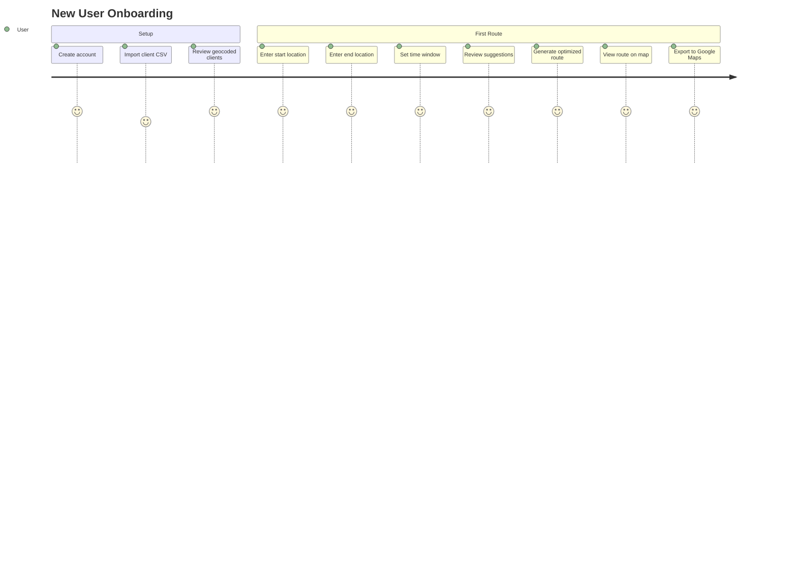
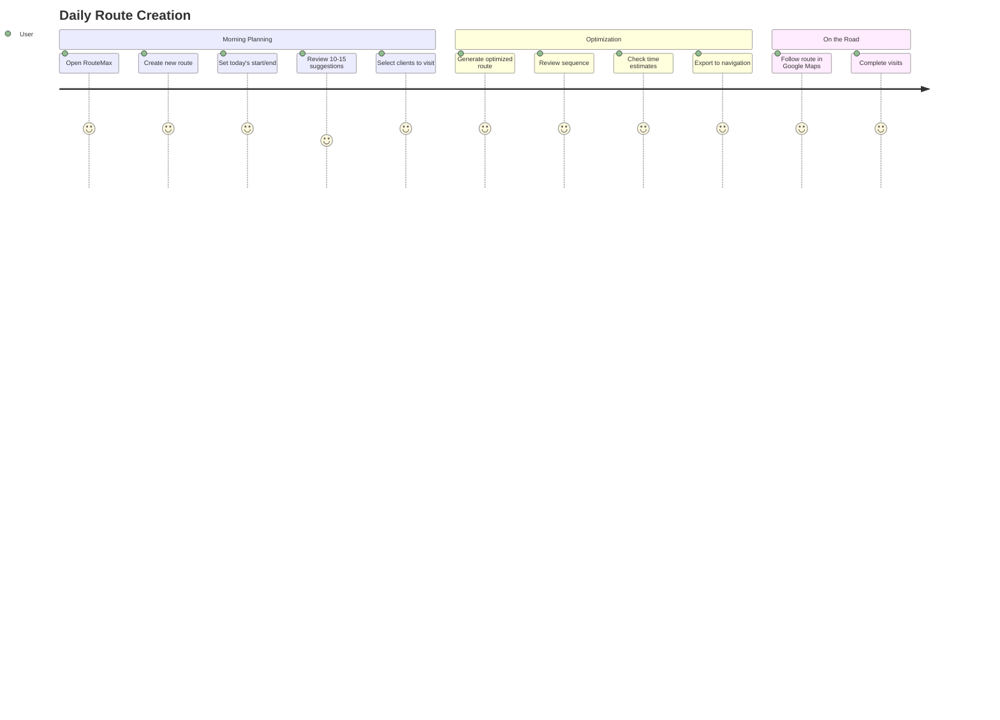
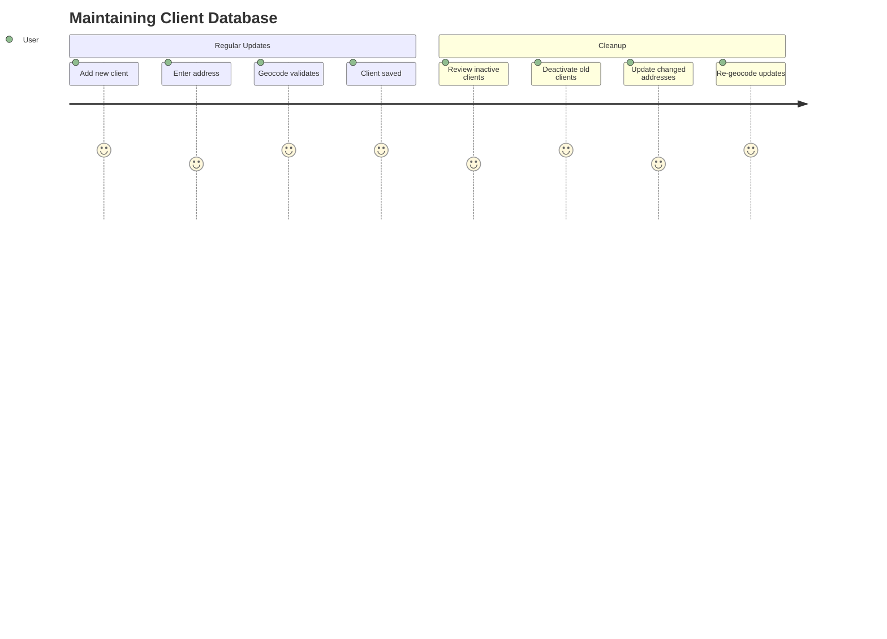
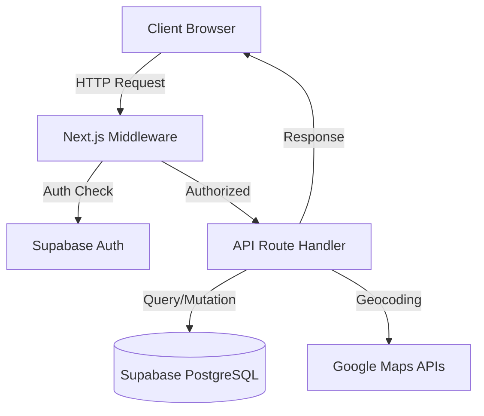
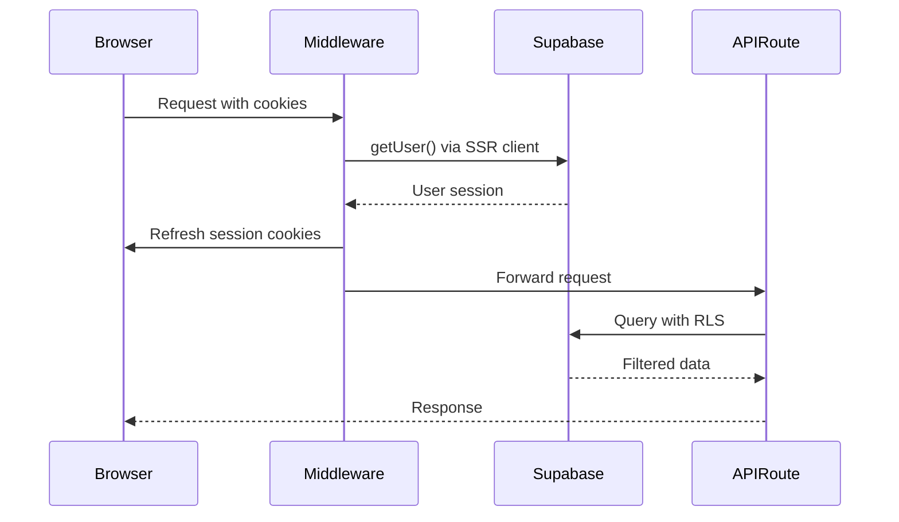
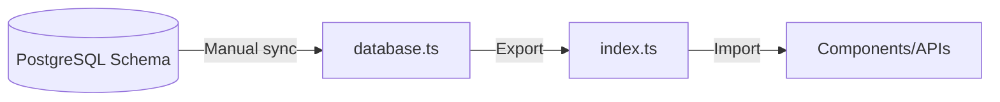
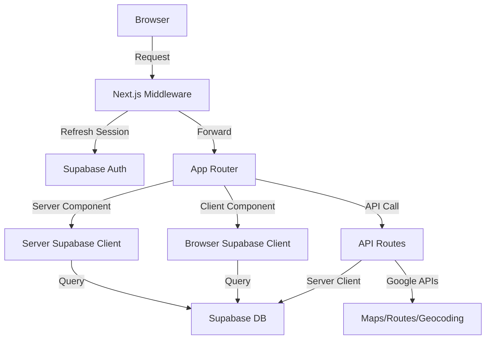
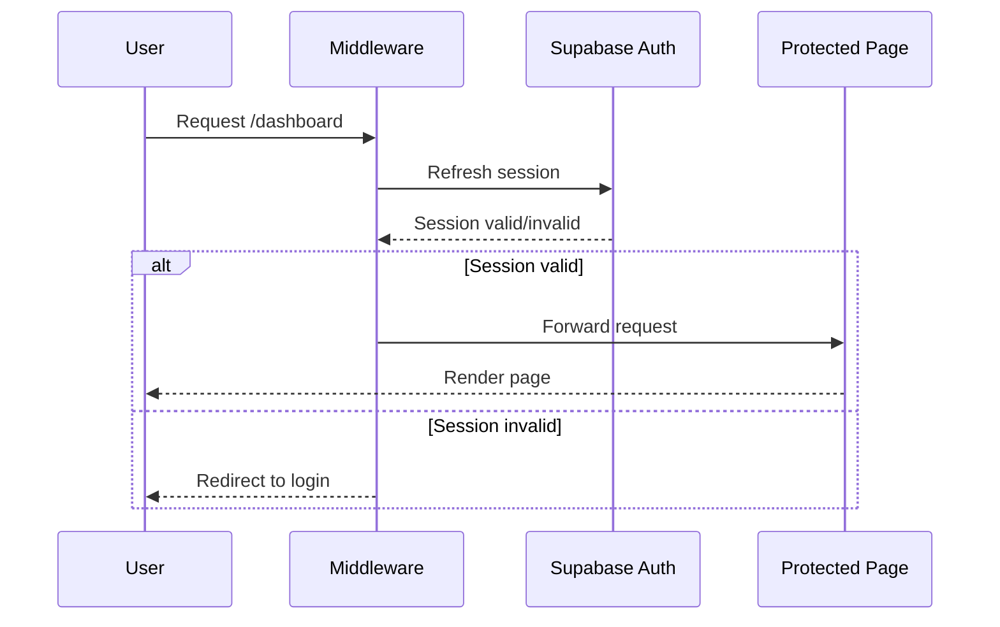

# AGENTS.md

> IMPORTANT: On first conversation message, say "AI-Driven Development ON - Date: {current_date}, TZ: {current_timezone}." to User.

This file contains a collection of config, context, rules, information etc for a project.

The goal is to provide to the ASSISTANT a clear understanding of the project's context, including its structure, dependencies, and any specific conventions that should be followed.

All instructions and information above are willing to be up to date, but always remind yourself that USER can be wrong, be critical of the information provided, and verify it against the project's actual state.

## Roles

- **USER**: The human developer interacting with the AI assistant, providing instructions, feedback, and context about the project.
- **ASSISTANT**: The AI assistant (you) that helps the USER as a senior software engineer. You do orchestrate the development process, ensuring that the code is clean, efficient, and adheres to best practices. Delegate tasks to specialized agents when necessary.

## Important context

- Current date: !`date +%Y-%m-%d`
- Timezone: !`date +%Z`
- The user's timezone and date are defined {current_date} + {current_timezone}, use them for any date-related task.
- Any dates before this are in the past, and any dates after this are in the   future. When the user asks for the 'latest', 'most recent', 'today's', etc.
- Don't assume your knowledge is up to date.

## Mandatory Rules

- **Avoid complexity**: stay simple, pragmatic, effective
- When dealing with github, use `gh` cli
- **No over-engineering**: focus on requirements
- **No silent error**, throw exceptions early
- **No extra feature**, focus only on core functionality
- Always write code that match versions

### Code Quality Standards

- Eliminate duplication ruthlessly
- Express intent clearly through naming and structure
- Make dependencies explicit
- Keep methods small and focused on a single responsibility
- Minimize state and side effects

### Refactoring Guidelines

- Preserve the intent
- Avoid comments on obvious code, make code self-explanatory instead
- Only add code comments when tricky logic is involved

### Testing Guidelines

- Always write tests first for bug fixes
- When testing: never mock functional components

## Answering Guidelines

- Be 100% sure of your answers.
- If unsure, say "I don't know" or ask for clarification.
- Never say "you are right!", prefer anticipating mistakes.

## MEMORY BANK

This section contains project-specific memory bank information, including context, architecture decisions, and implementation details.

The goal is to provide the ASSISTANT with a comprehensive understanding of the project's current state, past decisions, and ongoing context.

All information should be kept up to date and reflect the actual state of the project.
Finding .mdc/.md/.mmd/.txt files in: /Users/cedric/Dev/projects/RouteMax/docs/memory-bank
Found 15 .mdc/.md/.mmd/.txt files:
  - CODEBASE_STRUCTURE.md
  - DEPLOYMENT.md
  - PROJECT_BRIEF.md
  - STACK.md
  - backend/API_DOCS.md
  - backend/ARCHITECTURE.md
  - backend/CODING_ASSERTIONS.md
  - backend/DATABASE.md
  - backend/TESTING.md
  - frontend/ARCHITECTURE.md
  - frontend/BACKEND_COMMUNICATION.md
  - frontend/CODING_ASSERTIONS.md
  - frontend/DESIGN.md
  - frontend/FORMS.md
  - frontend/TESTING.md

Processing: CODEBASE_STRUCTURE.md

Processing: DEPLOYMENT.md

Processing: PROJECT_BRIEF.md

Processing: STACK.md

Processing: backend/API_DOCS.md

Processing: backend/ARCHITECTURE.md

Processing: backend/CODING_ASSERTIONS.md

Processing: backend/DATABASE.md

Processing: backend/TESTING.md

Processing: frontend/ARCHITECTURE.md

Processing: frontend/BACKEND_COMMUNICATION.md

Processing: frontend/CODING_ASSERTIONS.md

Processing: frontend/DESIGN.md

Processing: frontend/FORMS.md

Processing: frontend/TESTING.md

Writing merged content to: ../../../../../dev/stdout
### Codebase Structure

#### Overview

RouteMax is a Next.js 15 application using the App Router, TypeScript, and Tailwind CSS. The codebase follows Next.js conventions with clear separation between API routes, UI pages, components, and utilities.

#### Directory Tree

```
RouteMax/
├── @app/                         Next.js App Router (pages & API)
│   ├── @app/api/                 API routes (server-side)
│   │   ├── @app/api/clients/     Client management endpoints
│   │   ├── @app/api/geocode/     Address geocoding utility
│   │   └── @app/api/routes/      Route planning & optimization
│   ├── @app/dashboard/           Protected dashboard pages
│   │   ├── @app/dashboard/clients/   Client management UI
│   │   └── @app/dashboard/routes/    Route planning UI
│   ├── @app/globals.css          Global styles
│   ├── @app/layout.tsx           Root layout with metadata
│   └── @app/page.tsx             Landing page
│
├── @components/                  React components
│   ├── @components/clients/      Client-related components
│   ├── @components/routes/       Route-related components
│   └── @components/ui/           Shared UI components
│
├── @lib/                         Utilities & core logic
│   ├── @lib/supabase/            Supabase client configs
│   │   ├── @lib/supabase/client.ts      Browser client
│   │   ├── @lib/supabase/middleware.ts  Auth middleware
│   │   └── @lib/supabase/server.ts      Server client
│   ├── @lib/types/               TypeScript type definitions
│   │   ├── @lib/types/database.ts  Supabase schema types
│   │   └── @lib/types/index.ts     Domain types (Client, Route, etc.)
│   └── @lib/utils/               Helper functions (empty)
│
├── @supabase/                    Database configuration
│   ├── @supabase/migrations/     SQL migration files (4 files)
│   └── @supabase/README.md       Database setup guide
│
├── @public/                      Static assets (empty)
├── @middleware.ts                Next.js middleware (Supabase auth)
├── @next.config.ts               Next.js configuration
├── @tailwind.config.ts           Tailwind CSS config
└── @package.json                 Dependencies & scripts
```

#### Directory Purpose

##### @app/
Main application directory using Next.js App Router pattern.

**@app/api/** - Server-side API endpoints organized by feature (clients, routes, geocode). Each subdirectory maps to an API route.

**@app/dashboard/** - Protected pages for authenticated users. Contains client management and route planning interfaces.

**@app/layout.tsx** - Root layout defining HTML structure, metadata, and global styles.

**@app/page.tsx** - Public landing page (currently minimal).

##### @components/
React components organized by feature domain.

**@components/clients/** - Components for client list, import, and management.

**@components/routes/** - Components for route configuration, map display, and optimization.

**@components/ui/** - Reusable UI components (buttons, inputs, modals).

##### @lib/
Core utilities and shared logic.

**@lib/supabase/** - Supabase client initialization for different environments (browser, server, middleware).

**@lib/types/** - Centralized TypeScript types. `database.ts` contains Supabase-generated schema types, `index.ts` has domain models.

**@lib/utils/** - Helper functions (currently empty, placeholder for future utilities).

##### @supabase/
Database schema and migrations.

**@supabase/migrations/** - SQL files for database setup (clients table, PostGIS, routes, route_stops).

##### Root Configuration
**@middleware.ts** - Supabase authentication middleware, runs on all routes except static assets.

**@next.config.ts** - Next.js configuration (minimal, default settings).

**@tailwind.config.ts** - Tailwind CSS customization.

**@package.json** - Dependencies: Next.js 15, React 19, Supabase, Google Maps, TypeScript.

#### Organization Patterns

##### Feature-Based Structure
API routes and components organized by feature (clients, routes) for easy navigation and maintenance.

##### Type Safety
Centralized type definitions in @lib/types/ shared across frontend and backend. Database schema types auto-generated from Supabase.

##### Client Separation
Supabase clients split by environment (browser/server/middleware) to avoid hydration issues and ensure proper authentication context.

##### Empty Directories
Several directories (@app/api/clients/, @components/ui/, @lib/utils/, @public/) are currently empty, indicating planned but not yet implemented features.

#### Tech Stack

**Framework:** Next.js 15 (App Router)
**Language:** TypeScript (strict mode)
**Styling:** Tailwind CSS 4
**Database:** Supabase (PostgreSQL + PostGIS)
**Maps:** Google Maps APIs (Maps JS, Places, Geocoding, Routes)
**State:** React 19 (no global state library)
**Validation:** Zod

### Deployment

#### CI/CD Pipeline

##### <ci_flow>

- **No CI/CD configured**: Manual deployments via Vercel CLI or Git push

- **Deployment Triggers**:
  - Manual deployments: Push to production branch or via Vercel CLI
  - Automated deployments: Not configured (no GitHub Actions workflows)

#### Monitoring & Logging

- **Monitoring Tools**: Not configured

- **Logging**: Vercel runtime logs available via Vercel dashboard

- **Alert Configuration**: Not configured

#### Deployment Process

- **Deployment Steps**:

  1. Database migrations: Manual via Supabase SQL Editor
     - Run migrations in order from @supabase/migrations/
     - Enable PostGIS extension manually
  2. Environment variables: Configure in Vercel dashboard
  3. Deploy: Push to main branch or use `vercel --prod`

- **Rollback Procedure**:

  1. Use Vercel dashboard to redeploy previous deployment
  2. Verify rollback success via production URL
  3. Check Supabase logs for database issues

### Infrastructure

#### Project Structure

```plaintext
RouteMax/
├── app/                      # Next.js App Router
│   ├── api/                  # API routes
│   │   ├── clients/          # Client management APIs
│   │   ├── routes/           # Route planning APIs
│   │   └── geocode/          # Geocoding utility API
│   ├── dashboard/            # Dashboard pages
│   └── page.tsx              # Landing page
├── components/               # React components
├── lib/                      # Utilities
│   ├── supabase/             # Supabase clients
│   └── types/                # TypeScript types
├── supabase/                 # Database migrations
│   └── migrations/           # SQL migration files
└── public/                   # Static assets
```

#### Environments Variables

##### Environment Files

- `.env.example`: Template for required environment variables
- `.env.local`: Local development (gitignored)
- Vercel: Production environment variables via dashboard

##### Required Environment Variables

###### Supabase (Database & Auth)

- `NEXT_PUBLIC_SUPABASE_URL`: Supabase project URL
- `NEXT_PUBLIC_SUPABASE_ANON_KEY`: Supabase anonymous key for client-side auth

###### Google Cloud Platform (Maps & Optimization)

- `GOOGLE_CLOUD_PROJECT_ID`: GCP project identifier
- `NEXT_PUBLIC_GOOGLE_MAPS_API_KEY`: Client-side Maps JavaScript API key
- `GOOGLE_MAPS_API_KEY_SERVER`: Server-side API key for Routes Optimization, Places, Geocoding, Distance Matrix

###### Application

- `NEXT_PUBLIC_APP_URL`: Application base URL (http://localhost:3000 for dev)

#### URLs

- **Development**:

  - URL: http://localhost:3000
  - Purpose: Local development
  - Start: `npm run dev`

- **Production**:
  - URL: Not specified (deployed via Vercel)
  - Platform: Vercel
  - SLA: Vercel platform SLA

#### Containerization

No containerization configured. Next.js 15 app deployed via Vercel serverless platform.

### PROJECT_BRIEF.md

RouteMax is a route optimization tool designed specifically for traveling salespeople to eliminate manual planning and maximize their time in the field.

#### Executive Summary

- **Project Name**: RouteMax
- **Vision**: Save traveling salespeople 2+ hours per week by automating client selection and route sequencing
- **Mission**: Build an intelligent route planner that automatically identifies and sequences the best clients to visit along a salesperson's daily route

##### Full Description

RouteMax addresses the daily challenge faced by traveling salespeople who waste hours manually planning their routes. The application combines client database management with intelligent spatial analysis to automatically suggest which clients to visit based on route proximity, then optimizes the visit sequence using Google's routing algorithms. By eliminating spreadsheet juggling and guesswork, RouteMax lets salespeople focus on what matters: visiting more clients and closing more deals.

#### Context

##### Core Domain

RouteMax operates in the field sales optimization domain, specifically addressing the route planning challenge for individual traveling salespeople. The application bridges three key areas:

- **Client Management**: Maintaining an accurate, geocoded database of potential visit locations
- **Spatial Intelligence**: Using PostGIS geospatial queries to identify clients near a planned route
- **Route Optimization**: Leveraging Google Routes API to sequence visits efficiently while respecting time constraints

The system assumes users have an existing client base, plan single-day routes in advance, and prioritize time efficiency over other factors like client priority or visit frequency.

##### Ubiquitous Language

| Term | Definition | Synonymes |
| ---- | ---------- | --------- |
| `Client` | A potential visit location with name and geocoded address | Customer, Stop Candidate |
| `Route` | A planned journey with start point, end point, and time window | Journey, Trip, Tournée |
| `Stop` | An individual visit location within a route sequence | Visit, Waypoint |
| `Geocoding` | Converting street addresses to latitude/longitude coordinates | Address Resolution |
| `Route Line` | The direct path between route start and end points | Route Corridor, Route Path |
| `Spatial Query` | Database search based on geographic distance/proximity | Geospatial Search |
| `Optimization` | Algorithmic reordering of stops to minimize travel time | Sequencing, Route Solving |
| `Suggested Client` | A client identified as being near the planned route | Route Candidate |
| `Visit Duration` | Expected time spent at a client location | Stop Time, Dwell Time |

#### Features & Use-cases

- Import client database from CSV with automatic address geocoding
- Manage client list with add/edit/delete capabilities
- Configure route parameters with start/end locations and time windows
- Get intelligent client suggestions based on spatial proximity to route
- Generate optimized visit sequence minimizing total travel time
- View route on interactive map with markers and polylines
- Export route to Google Maps for navigation
- Access route history and saved routes

#### User Journey maps

##### Traveling Salesperson

- Role: Field sales representative managing 50-200 clients across a territory
- Goals: Visit maximum clients per day, minimize driving time, maintain consistent territory coverage
- Pain Points: Hours wasted on manual planning, suboptimal route sequences, difficulty identifying nearby opportunities

###### First-Time Setup Journey



###### Daily Route Planning Journey



###### Client Database Management Journey



<!--
IMPORTANT: THOSE ARE RULES FOR AI, DO NOT USE THOSE INTO FILLED TEMPLATE.

- THIS FILE ANSWERS: WHAT problem does it solve?
- INCLUDE ONLY: Business purpose, user goals, features, requirements
- DO NOT INCLUDE: Technical details, how it's built, visual design
-->

### Stack

#### Frontend

@package.json
- Next 15
- React 19
- TailwindCSS 4
- TypeScript 5

#### UI/Components

@package.json
- Sonner (toast notifications) 2

#### Maps

@package.json
- Google Maps Services JS 3
- React Google Maps API 2

#### Backend/Database

@package.json
- Supabase SSR 0
- Supabase JS 2

#### Utilities

@package.json
- Date-fns 4
- PapaParse 5 (CSV parsing)
- Zod 4 (validation)

#### Dev Tools

@package.json
- ESLint 9
- PostCSS 4

### RouteMax API Documentation

#### Overview

RouteMax API provides endpoints for client management, route planning, and optimization. All endpoints require authentication via Supabase Auth.

**Base URL**: `/api`
**Auth**: Supabase session cookie (handled by middleware)
**Content-Type**: `application/json`

---

#### Authentication

All API routes protected by @middleware.ts using Supabase Auth.

**Authentication Flow**:
1. User authenticates via Supabase Magic Link
2. Session stored in cookie
3. Middleware validates session on every request
4. `user_id` extracted from `auth.uid()`

**Unauthenticated Response**:
```json
{
  "error": "Unauthorized"
}
```
Status: `401`

---

#### Client Management

##### Import Clients

**Endpoint**: `POST /api/clients/import`

Import clients from CSV with automatic geocoding.

**Request Body**:
```typescript
{
  clients: Array<{
    name: string;
    address: string;
  }>
}
```

**Response** (200):
```typescript
{
  imported: number;
  failed: Array<{
    name: string;
    address: string;
    error: string;
  }>;
  clients: Client[];
}
```

**Client Type**:
```typescript
{
  id: string;
  name: string;
  address: string;
  lat: number;
  lng: number;
  is_active: boolean;
  created_at: string;
}
```

**Error Responses**:
- `400`: Invalid request body or schema validation failed
- `401`: User not authenticated
- `500`: Geocoding or database error

**Example**:
```bash
curl -X POST https://routemax.app/api/clients/import \
  -H "Content-Type: application/json" \
  -H "Cookie: sb-access-token=..." \
  -d '{
    "clients": [
      {"name": "Acme Corp", "address": "123 Main St, Paris"},
      {"name": "TechStart", "address": "456 Tech Blvd, Lyon"}
    ]
  }'
```

---

##### List Clients

**Endpoint**: `GET /api/clients`

Retrieve user's clients with pagination.

**Query Parameters**:
- `page` (optional, default: 1): Page number
- `limit` (optional, default: 50): Items per page
- `active_only` (optional, default: false): Filter active clients

**Response** (200):
```typescript
{
  clients: Client[];
  total: number;
  page: number;
  limit: number;
}
```

**Example**:
```bash
curl https://routemax.app/api/clients?page=1&limit=20&active_only=true \
  -H "Cookie: sb-access-token=..."
```

---

##### Update Client

**Endpoint**: `PUT /api/clients/[id]`

Update client information. Re-geocodes if address changed.

**Path Parameters**:
- `id`: Client UUID

**Request Body**:
```typescript
{
  name?: string;
  address?: string;
  is_active?: boolean;
}
```

**Response** (200):
```typescript
{
  client: Client;
}
```

**Error Responses**:
- `400`: Invalid input or validation failed
- `401`: Unauthorized
- `404`: Client not found or doesn't belong to user
- `500`: Geocoding or database error

**Example**:
```bash
curl -X PUT https://routemax.app/api/clients/123e4567-e89b-12d3 \
  -H "Content-Type: application/json" \
  -H "Cookie: sb-access-token=..." \
  -d '{"name": "Acme Corp Updated", "is_active": true}'
```

---

##### Delete Client

**Endpoint**: `DELETE /api/clients/[id]`

Soft-delete client (sets `is_active = false`).

**Path Parameters**:
- `id`: Client UUID

**Response** (200):
```typescript
{
  success: true;
}
```

**Error Responses**:
- `401`: Unauthorized
- `404`: Client not found
- `500`: Database error

**Example**:
```bash
curl -X DELETE https://routemax.app/api/clients/123e4567-e89b-12d3 \
  -H "Cookie: sb-access-token=..."
```

---

#### Route Planning

##### Suggest Clients

**Endpoint**: `POST /api/routes/suggest`

Get client suggestions based on route corridor using PostGIS spatial queries.

**Request Body**:
```typescript
{
  startLat: number;
  startLng: number;
  endLat: number;
  endLng: number;
  corridorRadiusKm: number; // default: 5
  maxSuggestions: number;   // default: 20
}
```

**Response** (200):
```typescript
{
  suggestions: SuggestedClient[];
}
```

**SuggestedClient Type**:
```typescript
{
  id: string;
  name: string;
  address: string;
  lat: number;
  lng: number;
  is_active: boolean;
  created_at: string;
  distanceFromRouteLine: number; // meters
  score: number; // 0-100, proximity-based
}
```

**Algorithm**:
1. Create LineString from start → end
2. Query clients within corridor radius using `ST_DWithin`
3. Calculate distance from route line with `ST_Distance`
4. Score based on proximity (closer = higher score)
5. Return top N suggestions ordered by score

**Error Responses**:
- `400`: Invalid coordinates or parameters
- `401`: Unauthorized
- `500`: PostGIS query error

**Example**:
```bash
curl -X POST https://routemax.app/api/routes/suggest \
  -H "Content-Type: application/json" \
  -H "Cookie: sb-access-token=..." \
  -d '{
    "startLat": 48.8566,
    "startLng": 2.3522,
    "endLat": 45.764,
    "endLng": 4.8357,
    "corridorRadiusKm": 10,
    "maxSuggestions": 15
  }'
```

---

##### Create Optimized Route

**Endpoint**: `POST /api/routes/optimize`

Generate optimized route using Google Routes API.

**Request Body**:
```typescript
{
  name: string;
  startAddress: string;
  startLat: number;
  startLng: number;
  startDatetime: string; // ISO 8601
  endAddress: string;
  endLat: number;
  endLng: number;
  endDatetime: string;   // ISO 8601
  clientIds: string[];   // UUIDs of clients to visit
  visitDurationMinutes?: number; // default: 20
}
```

**Response** (200):
```typescript
{
  route: Route;
  stops: RouteStop[];
}
```

**Route Type**:
```typescript
{
  id: string;
  name: string;
  startAddress: string;
  startLat: number;
  startLng: number;
  startDatetime: string;
  endAddress: string;
  endLat: number;
  endLng: number;
  endDatetime: string;
  totalDistanceKm: number | null;
  totalDurationMinutes: number | null;
  totalVisits: number;
  createdAt: string;
}
```

**RouteStop Type**:
```typescript
{
  id: string;
  clientId: string | null;
  clientName: string | null;
  address: string;
  lat: number;
  lng: number;
  stopOrder: number;
  estimatedArrival: string | null;
  estimatedDeparture: string | null;
  durationFromPrevious: number; // minutes
  distanceFromPrevious: number; // km
  visitDuration: number;        // minutes
  isIncluded: boolean;
}
```

**Process**:
1. Validate client IDs belong to user
2. Call Google Routes Optimization API
3. Insert route record
4. Insert route_stops with sequences
5. Return optimized route data

**Error Responses**:
- `400`: Invalid input, time window exceeded, or too many stops
- `401`: Unauthorized
- `403`: Client access denied
- `500`: Google API error or database error

**Example**:
```bash
curl -X POST https://routemax.app/api/routes/optimize \
  -H "Content-Type: application/json" \
  -H "Cookie: sb-access-token=..." \
  -d '{
    "name": "Monday Route",
    "startAddress": "10 Rue de Rivoli, Paris",
    "startLat": 48.8566,
    "startLng": 2.3522,
    "startDatetime": "2025-12-26T08:00:00Z",
    "endAddress": "20 Avenue des Champs-Élysées, Paris",
    "endLat": 48.8698,
    "endLng": 2.3078,
    "endDatetime": "2025-12-26T18:00:00Z",
    "clientIds": ["uuid1", "uuid2", "uuid3"],
    "visitDurationMinutes": 30
  }'
```

---

##### Get Route Details

**Endpoint**: `GET /api/routes/[id]`

Retrieve route with all stops.

**Path Parameters**:
- `id`: Route UUID

**Response** (200):
```typescript
{
  route: Route;
  stops: RouteStop[];
}
```

**Error Responses**:
- `401`: Unauthorized
- `404`: Route not found
- `500`: Database error

**Example**:
```bash
curl https://routemax.app/api/routes/123e4567-e89b-12d3 \
  -H "Cookie: sb-access-token=..."
```

---

##### List User Routes

**Endpoint**: `GET /api/routes/user`

Retrieve user's route history.

**Query Parameters**:
- `page` (optional, default: 1)
- `limit` (optional, default: 20)

**Response** (200):
```typescript
{
  routes: Route[];
  total: number;
  page: number;
  limit: number;
}
```

**Example**:
```bash
curl https://routemax.app/api/routes/user?page=1&limit=10 \
  -H "Cookie: sb-access-token=..."
```

---

##### Delete Route

**Endpoint**: `DELETE /api/routes/[id]`

Delete route and cascade-delete all stops.

**Path Parameters**:
- `id`: Route UUID

**Response** (200):
```typescript
{
  success: true;
}
```

**Error Responses**:
- `401`: Unauthorized
- `404`: Route not found
- `500`: Database error

**Example**:
```bash
curl -X DELETE https://routemax.app/api/routes/123e4567-e89b-12d3 \
  -H "Cookie: sb-access-token=..."
```

---

#### Utilities

##### Geocode Address

**Endpoint**: `POST /api/geocode`

Geocode single address using Google Geocoding API.

**Request Body**:
```typescript
{
  address: string;
}
```

**Response** (200):
```typescript
{
  address: string;          // original
  lat: number;
  lng: number;
  formattedAddress: string; // Google-formatted
}
```

**Error Responses**:
- `400`: Invalid or empty address
- `500`: Google API error
- `404`: Address not found

**Example**:
```bash
curl -X POST https://routemax.app/api/geocode \
  -H "Content-Type: application/json" \
  -d '{"address": "10 Rue de Rivoli, Paris"}'
```

**Note**: This endpoint does NOT require authentication (used in public forms).

---

#### Error Handling

All errors follow consistent format:

```typescript
{
  error: string;        // Human-readable message
  code?: string;        // Optional error code
  details?: unknown;    // Optional additional context
}
```

**HTTP Status Codes**:
- `200`: Success
- `400`: Bad Request (validation failed)
- `401`: Unauthorized (missing/invalid auth)
- `403`: Forbidden (authorized but not allowed)
- `404`: Not Found
- `500`: Internal Server Error

**Common Error Patterns**:
```typescript
// Validation error
{
  error: "Invalid request body",
  code: "VALIDATION_ERROR",
  details: { field: "startLat", message: "Must be a number" }
}

// Database error
{
  error: "Failed to fetch clients",
  code: "DATABASE_ERROR"
}

// External API error
{
  error: "Geocoding failed",
  code: "GOOGLE_API_ERROR",
  details: { status: "ZERO_RESULTS" }
}
```

---

#### Rate Limits

**Not implemented in MVP**. Future considerations:
- Google API quota limits apply
- Supabase connection pooling limits apply
- No explicit rate limiting per user

---

#### Validation

All endpoints use Zod for schema validation.

**Client Import Schema**:
```typescript
const importSchema = z.object({
  clients: z.array(
    z.object({
      name: z.string().min(1).max(255),
      address: z.string().min(1).max(500)
    })
  ).min(1).max(100)
});
```

**Route Creation Schema**:
```typescript
const routeSchema = z.object({
  name: z.string().min(1).max(255),
  startAddress: z.string().min(1),
  startLat: z.number().min(-90).max(90),
  startLng: z.number().min(-180).max(180),
  startDatetime: z.string().datetime(),
  endAddress: z.string().min(1),
  endLat: z.number().min(-90).max(90),
  endLng: z.number().min(-180).max(180),
  endDatetime: z.string().datetime(),
  clientIds: z.array(z.string().uuid()).min(1).max(25),
  visitDurationMinutes: z.number().min(5).max(120).optional()
});
```

---

#### Database Operations

All API routes use @lib/supabase/server.ts client with RLS enforcement.

**Access Pattern**:
```typescript
const supabase = createClient();
const { data, error } = await supabase
  .from('clients')
  .select('*')
  .eq('user_id', user.id); // RLS auto-filters
```

**RLS Guarantees**:
- Users can only access their own data
- No cross-user data leakage
- Enforced at database level

---

#### Google APIs Integration

##### Geocoding API
- **Endpoint**: `POST /api/geocode`
- **Usage**: Address → Coordinates
- **Quota**: Unlimited (pay-per-use)
- **Cost**: $5 per 1,000 requests

##### Routes Optimization API
- **Endpoint**: `POST /api/routes/optimize`
- **Usage**: Optimized route sequences
- **Quota**: Unlimited (pay-per-use)
- **Cost**: $10 per 1,000 optimizations
- **Limit**: 25 waypoints per route

**API Key**: `GOOGLE_MAPS_API_KEY_SERVER` (server-side only)

---

#### Implementation Status

**Current State**: API routes defined but NOT implemented.

**Planned Implementation Order**:
1. `POST /api/geocode` - Geocoding utility
2. `POST /api/clients/import` - CSV import
3. `GET /api/clients` - Client list
4. `PUT /api/clients/[id]` - Client update
5. `DELETE /api/clients/[id]` - Client delete
6. `POST /api/routes/suggest` - Client suggestions
7. `POST /api/routes/optimize` - Route creation
8. `GET /api/routes/[id]` - Route details
9. `GET /api/routes/user` - Route list
10. `DELETE /api/routes/[id]` - Route delete

**Testing**: See @docs/memory-bank/backend/TESTING.md

---

#### Related Documentation

- Database Schema: @docs/memory-bank/backend/DATABASE.md
- Type Definitions: @lib/types/index.ts, @lib/types/database.ts
- Project Structure: @docs/memory-bank/CODEBASE_STRUCTURE.md
- Supabase Config: @lib/supabase/


### Backend Architecture

#### Stack

- Next.js 15 App Router (API Routes)
- Supabase (PostgreSQL + PostGIS + Auth)
- Google Maps APIs (Geocoding, Routes, Places)
- TypeScript 5
- Zod 4 (validation)

#### Architecture Pattern

**Serverless API Routes** - Next.js App Router handles all backend operations through API routes at `@app/api/*`



#### API Routes Structure

Current structure (directories exist but no route handlers yet):

- `@app/api/clients/` - Client CRUD operations
- `@app/api/routes/` - Route planning and optimization
- `@app/api/geocode/` - Address geocoding utility

**WHY**: Next.js App Router convention - each directory represents a route segment

#### Authentication Flow



**WHY**: Supabase SSR handles session management across server/client boundary

##### Key Files

- `@middleware.ts` - Entry point, delegates to Supabase middleware
- `@lib/supabase/middleware.ts` - Session refresh logic using `@supabase/ssr`
- `@lib/supabase/server.ts` - Server-side Supabase client factory
- `@lib/supabase/client.ts` - Browser-side Supabase client factory

**WHY**: Separate clients prevent cookie access errors in different contexts

#### Database Layer

##### Tables

1. `clients` - User's client database
   - Geocoded addresses (lat/lng)
   - PostGIS geometry column for spatial queries
   - RLS enabled per user

2. `routes` - Saved route configurations
   - Start/end points with timestamps
   - Optimization metadata (JSONB)
   - RLS enabled per user

3. `route_stops` - Ordered stops per route
   - Links to clients or standalone addresses
   - Travel metrics (distance/duration)
   - RLS via route.user_id

**WHY**: Normalized schema separates concerns while maintaining referential integrity

##### PostGIS Integration

```sql
-- Geometry column auto-updated via trigger
ALTER TABLE clients ADD COLUMN geom GEOMETRY(Point, 4326);

-- Spatial index for fast proximity queries
CREATE INDEX idx_clients_geom ON clients USING GIST(geom);
```

**WHY**: PostGIS enables efficient corridor search for client suggestions along routes

#### Type Safety



- `@lib/types/database.ts` - Supabase table types (Row/Insert/Update)
- `@lib/types/index.ts` - Application domain types

**WHY**: TypeScript strict mode requires explicit types; manual sync needed (no auto-gen configured)

#### External API Integration

##### Google Maps Services

Planned integrations (not yet implemented):

- **Geocoding API** - Convert addresses to coordinates
- **Routes Optimization API** - Multi-stop route optimization
- **Places API** - Address autocomplete

Package: `@googlemaps/google-maps-services-js` v3

**WHY**: Server-side API key separation prevents client exposure

#### Request/Response Flow

##### Typical API Route Pattern

```typescript
// 1. Auth check (automatic via middleware)
// 2. Get Supabase client with user context
const supabase = await createClient()

// 3. Parse/validate request
const body = await request.json()
// Zod validation here

// 4. Database operation (RLS auto-filters by user_id)
const { data, error } = await supabase
  .from('clients')
  .select('*')

// 5. Error handling
if (error) throw error

// 6. Return JSON response
return Response.json(data)
```

**WHY**: Middleware handles auth, RLS handles authorization - no manual user_id checks needed

#### Security Architecture

##### Row Level Security (RLS)

All tables have policies enforcing `auth.uid() = user_id`:

```sql
CREATE POLICY "Users can view their own clients"
  ON clients FOR SELECT
  USING (auth.uid() = user_id);
```

**WHY**: Database-level security prevents privilege escalation bugs

##### API Keys

- `NEXT_PUBLIC_GOOGLE_MAPS_API_KEY` - Browser (domain-restricted)
- `GOOGLE_MAPS_API_KEY_SERVER` - Server (IP-restricted)
- `NEXT_PUBLIC_SUPABASE_ANON_KEY` - Public (RLS protected)

**WHY**: Separate keys limit blast radius if exposed

#### Data Validation

Zod 4 schemas for:
- Request body validation
- Response type safety
- CSV import parsing

**WHY**: Runtime validation catches malformed data before database operations

#### Performance Considerations

##### Indexes

- `idx_clients_user_id` - Filter by user
- `idx_clients_active` - Active clients only
- `idx_clients_geom` - Spatial queries (GIST)
- `idx_routes_created_at` - Recent routes first

**WHY**: Optimize common query patterns (user filtering, spatial search, sorting)

##### Triggers

- `update_clients_updated_at` - Auto-timestamp on update
- `trigger_update_client_geom` - Sync geometry with lat/lng changes

**WHY**: Maintain data consistency without application-level logic

#### Error Handling

Planned pattern:
- Try-catch all async operations
- Return structured error responses
- Log errors server-side
- User-friendly messages client-side

**WHY**: Prevent unhandled promise rejections and expose minimal error details

#### Cost Management

##### Google Routes Optimization API

- $10 per 1,000 optimizations
- Budget alerts: $50, $100, $200
- Projected: $20/month (100 users, 5 routes/week each)

**WHY**: Monitor usage to prevent surprise bills; optimize API calls

#### Development Status

Current state: **Infrastructure Ready, No Route Handlers**

- API directory structure created
- Database schema deployed
- Auth middleware configured
- Type definitions complete
- No actual API endpoints implemented yet

Next: Implement route handlers starting with `POST /api/clients/import`


### Backend Coding Assertions

#### API Route Patterns

##### Route Handler Structure
- Next.js 15 App Router API routes: `/app/api/[feature]/route.ts`
- Named exports: `GET`, `POST`, `PUT`, `DELETE`, `PATCH`
- Function signature: `async function GET(request: NextRequest)`
- Return type: `NextResponse` or `Response`

##### Response Conventions
- Success: `NextResponse.json({ data }, { status: 200 })`
- Created: `NextResponse.json({ data }, { status: 201 })`
- Error: `NextResponse.json({ error: string }, { status: 4xx/5xx })`
- Always return JSON, never plain text

#### TypeScript Usage

##### Strict Mode Enabled
- `tsconfig.json` has `"strict": true`
- All function parameters must have explicit types
- No implicit `any` types allowed
- Use `!` assertion only for verified env vars: `process.env.VAR!`

##### Type Imports
- Database types: `import { Database } from '@/lib/types/database'`
- Domain types: `import { Client, Route, RouteStop } from '@/lib/types'`
- Supabase client type: `createServerClient<Database>(...)`
- Next types: `import { type NextRequest } from 'next/server'`

##### Database Type Patterns
- Table Row: `Database['public']['Tables']['clients']['Row']`
- Insert: `Database['public']['Tables']['clients']['Insert']`
- Update: `Database['public']['Tables']['clients']['Update']`
- Use domain types for frontend, database types for backend

#### Error Handling

##### Server-Side Errors
- Wrap async operations in try-catch blocks
- Silent catch only for Server Components: `catch { /* Server Component */ }`
- API routes: always return error JSON, never throw to client
- Log errors before returning response (when logging implemented)

##### Error Response Format
```typescript
NextResponse.json(
  { error: 'Clear user-facing message' },
  { status: 400 | 401 | 403 | 404 | 500 }
)
```

##### Status Code Usage
- `400` - Invalid request data
- `401` - Unauthenticated
- `403` - Unauthorized (authenticated but not allowed)
- `404` - Resource not found
- `500` - Internal server error

#### Validation Patterns

##### Zod Schema Location
- Define schemas at top of route file or in separate schema file
- Import: `import { z } from 'zod'`
- Parse before using: `const data = schema.parse(await request.json())`

##### Validation Example
```typescript
const createClientSchema = z.object({
  name: z.string().min(1),
  address: z.string().min(1),
  lat: z.number().min(-90).max(90),
  lng: z.number().min(-180).max(180)
});

// In route handler
const body = createClientSchema.parse(await request.json());
```

##### Error Handling
- Zod parse failures: catch `ZodError` → `400` response
- Return first error: `error.errors[0].message`

#### Async/Await Patterns

##### Supabase Queries
- Always `await` Supabase operations
- Chain `.select()`, `.insert()`, `.update()`, `.delete()`
- Check for errors: `const { data, error } = await supabase.from(...)`
- Early return on error: `if (error) return NextResponse.json(...)`

##### Server Client Creation
```typescript
import { createClient } from '@/lib/supabase/server';

export async function GET(request: NextRequest) {
  const supabase = await createClient(); // await required
  const { data, error } = await supabase.from('clients').select();
  // ...
}
```

##### No Client Components in API Routes
- Never use `'use client'` in API routes
- Use `cookies()` from `next/headers` (async in Next 15)
- No React hooks in route handlers

#### Authentication Patterns

##### User ID Retrieval
```typescript
const { data: { user } } = await supabase.auth.getUser();
if (!user) return NextResponse.json({ error: 'Unauthorized' }, { status: 401 });
const userId = user.id;
```

##### RLS Enforcement
- Database enforces RLS policies
- Always filter by `user_id` in queries for redundancy
- Trust RLS for security, explicit filters for clarity

#### Database Query Patterns

##### Row Level Security
- All tables have RLS enabled
- Policies enforce `auth.uid() = user_id`
- No manual user_id filtering needed (but recommended for clarity)

##### Insert Pattern
```typescript
const { data, error } = await supabase
  .from('clients')
  .insert({ user_id: userId, name, address, lat, lng })
  .select()
  .single();
```

##### Update Pattern
```typescript
const { data, error } = await supabase
  .from('clients')
  .update({ name, address })
  .eq('id', clientId)
  .select()
  .single();
```

##### Delete Pattern
```typescript
const { error } = await supabase
  .from('clients')
  .delete()
  .eq('id', clientId);
```

##### Query Pattern
```typescript
const { data, error } = await supabase
  .from('clients')
  .select('*')
  .eq('user_id', userId)
  .eq('is_active', true)
  .order('created_at', { ascending: false });
```

#### Environment Variables

##### Required Vars
- `NEXT_PUBLIC_SUPABASE_URL` - Supabase project URL
- `NEXT_PUBLIC_SUPABASE_ANON_KEY` - Supabase anon key
- `GOOGLE_MAPS_API_KEY` - Server-side Google Maps key (not NEXT_PUBLIC)

##### Usage Pattern
```typescript
// Client-safe (NEXT_PUBLIC prefix)
process.env.NEXT_PUBLIC_SUPABASE_URL!

// Server-only (no prefix)
process.env.GOOGLE_MAPS_API_KEY!
```

##### Validation
- Use `!` assertion for required vars defined in `.env.local`
- Consider runtime validation for critical vars

#### Import Patterns

##### Path Aliases
- Use `@/` prefix for all imports: `import { createClient } from '@/lib/supabase/server'`
- Never use relative paths: `../../lib/...`
- Configured in `tsconfig.json`: `"@/*": ["./*"]`

##### Import Order (Convention)
1. Next.js imports
2. Third-party imports
3. Type imports
4. Local imports (lib, components, types)

#### Middleware Conventions

##### Auth Middleware
- Defined in `/middleware.ts`
- Runs on all routes except static assets
- Uses `@/lib/supabase/middleware` updateSession
- No custom auth logic, delegate to Supabase

##### Route Matcher
```typescript
export const config = {
  matcher: [
    '/((?!_next/static|_next/image|favicon.ico|.*\\.(?:svg|png|jpg|jpeg|gif|webp)$).*)',
  ],
};
```

#### Performance Patterns

##### Database Indexes
- Leverage existing indexes: `idx_clients_user_id`, `idx_clients_active`
- Query with indexed columns: `.eq('user_id', userId)`
- Order by indexed columns for performance

##### Caching
- No caching implemented yet
- Future: use Next.js `revalidatePath()` for data mutations
- Avoid client-side data caching (Supabase client handles)

#### API Design Patterns

##### RESTful Conventions
- `GET /api/clients` - List all
- `GET /api/clients/[id]` - Get one
- `POST /api/clients` - Create
- `PUT /api/clients/[id]` - Update
- `DELETE /api/clients/[id]` - Delete

##### Request Body
- Parse with `await request.json()`
- Validate with Zod before using
- Return 400 on parse failures

##### URL Parameters
- Dynamic routes: `/api/clients/[id]/route.ts`
- Access via: `params.id` (destructure from second arg)
- Validate params exist before using

##### Response Body
- Success: `{ data: T }` or `{ data: T[] }`
- Error: `{ error: string }`
- Never mix data and error in same response


### RouteMax Database Schema

#### Overview

RouteMax uses **Supabase (PostgreSQL)** with **PostGIS** extension for spatial queries and route optimization.

**Migrations**: @supabase/migrations/

#### Schema Diagram

```
auth.users (Supabase Auth)
    ↓
clients (geocoded customer locations)
    ↓
routes (optimized delivery routes)
    ↓
route_stops (ordered stops with timing)
```

#### Tables

##### `clients`

Customer locations with geocoding and spatial data.

**Columns:**
- `id` UUID (PK)
- `user_id` UUID (FK → auth.users)
- `name` TEXT
- `address` TEXT
- `lat` FLOAT
- `lng` FLOAT
- `geom` GEOMETRY(Point, 4326) - PostGIS spatial column
- `geocoded_at` TIMESTAMP
- `is_active` BOOLEAN
- `created_at` TIMESTAMP
- `updated_at` TIMESTAMP

**Indexes:**
- `idx_clients_user_id` on `user_id`
- `idx_clients_active` on `user_id, is_active`
- `idx_clients_geom` GIST spatial index on `geom`

**Triggers:**
- `update_clients_updated_at` - auto-updates `updated_at`
- `trigger_update_client_geom` - auto-syncs `geom` from `lat`/`lng`

**RLS Policies:**
- Users can only CRUD their own clients (scoped by `user_id`)

---

##### `routes`

Optimized delivery routes with start/end points and metadata.

**Columns:**
- `id` UUID (PK)
- `user_id` UUID (FK → auth.users)
- `name` TEXT
- `start_address` TEXT
- `start_lat` FLOAT
- `start_lng` FLOAT
- `start_datetime` TIMESTAMP
- `end_address` TEXT
- `end_lat` FLOAT
- `end_lng` FLOAT
- `end_datetime` TIMESTAMP
- `total_distance_km` FLOAT
- `total_duration_minutes` INTEGER
- `total_visits` INTEGER
- `optimization_metadata` JSONB - stores algorithm results
- `created_at` TIMESTAMP
- `updated_at` TIMESTAMP

**Indexes:**
- `idx_routes_user_id` on `user_id`
- `idx_routes_created_at` on `user_id, created_at DESC`

**Triggers:**
- `update_routes_updated_at` - auto-updates `updated_at`

**RLS Policies:**
- Users can only CRUD their own routes (scoped by `user_id`)

---

##### `route_stops`

Individual stops in a route with ordering and timing estimates.

**Columns:**
- `id` UUID (PK)
- `route_id` UUID (FK → routes, CASCADE delete)
- `client_id` UUID (FK → clients, SET NULL on delete)
- `address` TEXT
- `lat` FLOAT
- `lng` FLOAT
- `stop_order` INTEGER - sequence in route
- `estimated_arrival` TIMESTAMP
- `estimated_departure` TIMESTAMP
- `duration_from_previous_minutes` INTEGER
- `distance_from_previous_km` FLOAT
- `visit_duration_minutes` INTEGER (default: 20)
- `is_included` BOOLEAN - for route exclusions
- `created_at` TIMESTAMP

**Indexes:**
- `idx_route_stops_route_id` on `route_id, stop_order`
- `idx_route_stops_client_id` on `client_id`

**RLS Policies:**
- Users can CRUD stops only for routes they own (via JOIN with `routes.user_id`)

---

#### PostGIS Spatial Features

##### Extension Setup
@supabase/migrations/002_enable_postgis.sql

```sql
CREATE EXTENSION IF NOT EXISTS postgis;
```

##### Spatial Column: `clients.geom`

- **Type**: `GEOMETRY(Point, 4326)`
- **SRID**: 4326 (WGS 84 - standard GPS coordinates)
- **Index**: GIST for fast spatial queries

##### Auto-sync Trigger

```sql
CREATE OR REPLACE FUNCTION update_client_geom()
RETURNS TRIGGER AS $$
BEGIN
    NEW.geom = ST_SetSRID(ST_MakePoint(NEW.lng, NEW.lat), 4326);
    RETURN NEW;
END;
$$ LANGUAGE plpgsql;
```

**Fired on**: INSERT or UPDATE of `lat`/`lng` columns

##### Common Spatial Queries

**Find clients within radius:**
```sql
SELECT * FROM clients
WHERE ST_DWithin(
  geom::geography,
  ST_SetSRID(ST_MakePoint($lng, $lat), 4326)::geography,
  $radius_meters
);
```

**Calculate distance between points:**
```sql
SELECT ST_Distance(
  geom1::geography,
  geom2::geography
) AS distance_meters;
```

**Nearest neighbors:**
```sql
SELECT * FROM clients
ORDER BY geom <-> ST_SetSRID(ST_MakePoint($lng, $lat), 4326)
LIMIT 10;
```

---

#### Row Level Security (RLS)

**All tables** have RLS enabled with user-scoped policies.

##### Policy Pattern: `clients` and `routes`
- Direct `user_id` check: `auth.uid() = user_id`
- Applied to: SELECT, INSERT, UPDATE, DELETE

##### Policy Pattern: `route_stops`
- Indirect via JOIN: Check if parent route belongs to user
```sql
EXISTS (
  SELECT 1 FROM routes
  WHERE routes.id = route_stops.route_id
  AND routes.user_id = auth.uid()
)
```

**Security guarantee**: Users cannot access data owned by other users.

---

#### Access Patterns

##### 1. Client Management
```sql
-- List active clients for user
SELECT * FROM clients
WHERE user_id = auth.uid() AND is_active = true
ORDER BY name;

-- Spatial proximity search
SELECT * FROM clients
WHERE ST_DWithin(
  geom::geography,
  ST_SetSRID(ST_MakePoint($lng, $lat), 4326)::geography,
  5000 -- 5km radius
);
```

##### 2. Route Creation
```sql
-- Insert route with metadata
INSERT INTO routes (user_id, name, start_lat, start_lng, ...)
VALUES (auth.uid(), 'Morning Route', ...);

-- Bulk insert stops
INSERT INTO route_stops (route_id, client_id, stop_order, ...)
SELECT ... FROM unnest($stops);
```

##### 3. Route Retrieval
```sql
-- Get route with all stops
SELECT
  r.*,
  json_agg(rs.* ORDER BY rs.stop_order) AS stops
FROM routes r
LEFT JOIN route_stops rs ON r.id = rs.route_id
WHERE r.user_id = auth.uid() AND r.id = $route_id
GROUP BY r.id;
```

##### 4. Analytics
```sql
-- Total distance by user
SELECT SUM(total_distance_km) FROM routes
WHERE user_id = auth.uid();

-- Most visited clients
SELECT c.name, COUNT(rs.id) AS visit_count
FROM clients c
JOIN route_stops rs ON c.id = rs.client_id
JOIN routes r ON rs.route_id = r.id
WHERE r.user_id = auth.uid()
GROUP BY c.id, c.name
ORDER BY visit_count DESC;
```

---

#### Performance Optimizations

##### Indexes
- **Composite**: `(user_id, is_active)` for filtered client lists
- **Spatial GIST**: Fast proximity searches on `clients.geom`
- **Ordering**: `(user_id, created_at DESC)` for recent routes
- **Foreign keys**: `route_id, stop_order` for stop retrieval

##### Triggers
- Auto-maintain `updated_at` on changes
- Auto-sync `geom` from `lat`/`lng` changes
- No manual geometry updates needed

##### JSONB Metadata
- `routes.optimization_metadata` stores algorithm parameters
- Allows flexible schema for different optimization strategies
- No additional tables needed for algorithm-specific data

---

#### Migration Order

1. **001_create_clients_table.sql** - Base client data with RLS
2. **002_enable_postgis.sql** - Spatial extension + geometry column
3. **003_create_routes_table.sql** - Routes with metadata
4. **004_create_route_stops_table.sql** - Stop sequences with cascade deletes

**Cascades**:
- Delete user → Delete all clients/routes
- Delete route → Delete all route_stops
- Delete client → Set `route_stops.client_id` to NULL (preserve historical stops)


### Backend Testing

#### Current State

No test infrastructure exists. API routes defined but not implemented:
- @app/api/clients
- @app/api/geocode
- @app/api/routes

#### Testing Guidelines (from project standards)

##### Test-First Approach
- Write tests first for bug fixes
- Never mock functional components

##### API Testing Standards
- Test API endpoints as integration tests
- Validate request/response schemas with Zod
- Test error handling explicitly
- No silent errors - throw early

##### Structure Principles
- Keep tests small and focused
- Express intent through naming
- Make dependencies explicit
- Minimize state and side effects

#### Recommended Setup

##### Testing Stack
- Next.js built-in testing (when configured)
- Zod for schema validation
- Test API routes against actual Supabase test database

##### Testing Patterns
```typescript
// API route test structure
describe('POST /api/routes', () => {
  it('creates route with valid data', async () => {
    // Arrange: prepare request
    // Act: call API
    // Assert: verify response + side effects
  })

  it('rejects invalid schema', async () => {
    // Test Zod validation
  })
})
```

##### Coverage Focus
1. Schema validation (Zod)
2. Error handling
3. Database operations
4. Business logic

#### Status
Testing infrastructure not yet implemented. Follow guidelines when adding tests.


### Frontend Architecture

#### Tech Stack

- Next.js 15 (App Router)
- React 19
- TypeScript 5 (strict mode)
- Tailwind CSS 4
- Supabase (auth + database)
- Google Maps APIs (@react-google-maps/api)

#### Directory Structure

```
app/
├── api/                    # API Routes (Server-side)
│   ├── clients/           # Client management endpoints
│   ├── routes/            # Route optimization endpoints
│   └── geocode/           # Geocoding utility endpoint
├── dashboard/             # Protected app pages
│   ├── clients/           # Client management UI
│   └── routes/            # Route planning UI
├── layout.tsx             # Root layout (Server Component)
├── page.tsx               # Landing page (Server Component)
└── globals.css            # Global styles

components/                # React Components
├── clients/               # Client-related components
├── routes/                # Route-related components
└── ui/                    # Shared UI components

lib/
├── supabase/
│   ├── client.ts          # Browser client (Client Components)
│   ├── server.ts          # Server client (Server Components)
│   └── middleware.ts      # Auth session management
├── types/
│   ├── database.ts        # Supabase generated types
│   └── index.ts           # App domain types
└── utils/                 # Helper functions

middleware.ts              # Next.js middleware (auth)
```

#### Architecture Patterns

##### Next.js App Router

- Default to Server Components for data fetching
- Use Client Components only when needed (interactivity, hooks)
- API Routes for backend operations (auth-protected)
- Middleware for session refresh on every request

##### Data Flow



##### Component Architecture

- **Server Components** (default)
  - Data fetching from Supabase
  - No client-side JavaScript
  - Direct database access via @lib/supabase/server

- **Client Components** (`"use client"`)
  - User interactions
  - React hooks (useState, useEffect)
  - Browser APIs
  - Access database via @lib/supabase/client

##### Supabase Integration

- **Three client types**
  - Browser client: @lib/supabase/client (Client Components)
  - Server client: @lib/supabase/server (Server Components, API Routes)
  - Middleware client: @lib/supabase/middleware (session refresh)

- **Authentication flow**
  - Middleware refreshes session on every request
  - Cookies managed via Next.js cookie API
  - RLS policies enforce data access

- **Type safety**
  - Database types in @lib/types/database
  - Generated from Supabase schema
  - Used for all client instances

#### Key Design Decisions

##### WHY App Router over Pages Router
- Server Components reduce client bundle size
- Built-in data fetching patterns
- Simplified routing with file-system
- Better SEO with default SSR

##### WHY Supabase SSR Package
- Cookie-based session management
- Compatible with Next.js middleware
- Automatic session refresh
- Secure auth state across server/client

##### WHY Separate API Routes
- Centralize business logic
- Protect API keys (Google Maps server key)
- Enable server-side validation with Zod
- Reusable across different UI components

##### WHY TypeScript Strict Mode
- Catch errors at compile time
- Type-safe database queries
- Better IDE autocomplete
- Enforces null checks

##### WHY Minimal Client Components
- Faster initial page load
- Better SEO
- Reduced JavaScript bundle
- Use only when needed (forms, maps, interactions)

#### State Management

- **No global state library** (Redux, Zustand)
- Server Components fetch fresh data
- Client Components use React state (useState)
- URL state for pagination/filters
- Supabase real-time for live updates (future)

#### Routing Strategy

```
/                          # Landing page (public)
/dashboard/clients         # Client list (protected)
/dashboard/routes          # Route planning (protected)
/api/clients/import        # CSV import endpoint
/api/routes/suggest        # Client suggestions
/api/routes/optimize       # Route optimization
```

#### Authentication Flow



#### API Route Pattern

All API routes follow this structure:

```typescript
// app/api/[resource]/route.ts
import { createClient } from '@/lib/supabase/server';

export async function POST(request: Request) {
  // 1. Auth check
  const supabase = await createClient();
  const { data: { user } } = await supabase.auth.getUser();
  if (!user) return Response.json({ error: 'Unauthorized' }, { status: 401 });

  // 2. Parse and validate input
  const body = await request.json();
  const validated = schema.parse(body); // Zod

  // 3. Business logic
  const result = await doSomething(validated);

  // 4. Return response
  return Response.json(result);
}
```

#### Data Access Patterns

##### Server Component
```typescript
import { createClient } from '@/lib/supabase/server';

export default async function Page() {
  const supabase = await createClient();
  const { data } = await supabase.from('clients').select();
  return <List clients={data} />;
}
```

##### Client Component
```typescript
'use client';
import { createClient } from '@/lib/supabase/client';

export function ClientList() {
  const [clients, setClients] = useState([]);
  const supabase = createClient();

  useEffect(() => {
    supabase.from('clients').select()
      .then(({ data }) => setClients(data));
  }, []);

  return <ul>{clients.map(...)}</ul>;
}
```

##### API Route Call
```typescript
'use client';

async function importClients(file: File) {
  const formData = new FormData();
  formData.append('file', file);

  const response = await fetch('/api/clients/import', {
    method: 'POST',
    body: formData,
  });

  return response.json();
}
```

#### Error Handling

- All async operations wrapped in try-catch
- API routes return proper HTTP status codes
- Client-side errors shown via `sonner` toast
- Server errors logged to console (Vercel logs)

#### Performance Strategies

- Server Components for static content
- Dynamic imports for large client components
- Google Maps lazy loading
- Database queries use indexes
- Pagination for large lists

#### Security Measures

- RLS policies on all tables
- API keys in environment variables
- Server-only API key (Google Maps)
- CSRF protection via Supabase
- Input validation with Zod

#### Environment Configuration

```env
### Public (exposed to browser)
NEXT_PUBLIC_SUPABASE_URL
NEXT_PUBLIC_SUPABASE_ANON_KEY
NEXT_PUBLIC_GOOGLE_MAPS_API_KEY
NEXT_PUBLIC_APP_URL

### Private (server-only)
GOOGLE_MAPS_API_KEY_SERVER
GOOGLE_CLOUD_PROJECT_ID
```

#### Future Considerations

- Real-time updates with Supabase subscriptions
- Optimistic UI updates
- Client-side caching (React Query)
- Progressive Web App (PWA)
- Offline support


### Frontend-Backend Communication

#### Overview

RouteMax uses **Supabase** for database operations with Next.js 15 App Router. No REST API routes are currently implemented - all data access is via Supabase client.

#### Authentication

##### Supabase Auth Flow

**Client Setup**: @lib/supabase/client.ts
```typescript
import { createClient } from '@/lib/supabase/client'

const supabase = createClient()
```

**Server Setup**: @lib/supabase/server.ts
```typescript
import { createClient } from '@/lib/supabase/server'

const supabase = await createClient()
```

**Middleware**: @middleware.ts + @lib/supabase/middleware.ts
- Runs on every request (except static assets)
- Validates and refreshes auth session
- Updates auth cookies via `supabase.auth.getUser()`

##### Auth Patterns

**Client-side:**
```typescript
// Sign in
const { data, error } = await supabase.auth.signInWithPassword({
  email,
  password
})

// Get current user
const { data: { user } } = await supabase.auth.getUser()

// Sign out
await supabase.auth.signOut()
```

**Server-side:**
```typescript
// In Server Component or Route Handler
const supabase = await createClient()
const { data: { user } } = await supabase.auth.getUser()

if (!user) {
  redirect('/login')
}
```

---

#### Data Access Patterns

##### Direct Supabase Queries

All database operations use Supabase client directly (no API routes).

**Type Safety**: @lib/types/database.ts
```typescript
import { Database } from '@/lib/types/database'

// Typed table access
type Client = Database['public']['Tables']['clients']['Row']
type ClientInsert = Database['public']['Tables']['clients']['Insert']
```

##### Common Query Patterns

**Fetch all clients:**
```typescript
const { data, error } = await supabase
  .from('clients')
  .select('*')
  .eq('is_active', true)
  .order('name')
```

**Insert client:**
```typescript
const { data, error } = await supabase
  .from('clients')
  .insert({
    name: 'Customer Name',
    address: '123 Street',
    lat: 40.7128,
    lng: -74.0060,
    user_id: user.id
  })
  .select()
  .single()
```

**Update client:**
```typescript
const { error } = await supabase
  .from('clients')
  .update({ is_active: false })
  .eq('id', clientId)
```

**Delete client:**
```typescript
const { error } = await supabase
  .from('clients')
  .delete()
  .eq('id', clientId)
```

**Fetch route with stops (JOIN):**
```typescript
const { data, error } = await supabase
  .from('routes')
  .select(`
    *,
    route_stops (
      *,
      clients (name, address)
    )
  `)
  .eq('id', routeId)
  .single()
```

---

#### Error Handling

##### Supabase Error Pattern

```typescript
const { data, error } = await supabase
  .from('clients')
  .select('*')

if (error) {
  console.error('Database error:', error.message)
  // Handle error (toast notification, etc.)
  return
}

// Use data safely
```

##### Auth Errors

```typescript
const { error } = await supabase.auth.signInWithPassword({
  email,
  password
})

if (error) {
  if (error.message.includes('Invalid login credentials')) {
    // Show user-friendly message
  }
}
```

##### RLS Policy Errors

```typescript
// Error when user tries to access another user's data
// RLS policies automatically return empty results or errors
const { data, error } = await supabase
  .from('clients')
  .select('*')
  .eq('user_id', otherUserId) // Will fail due to RLS

// Error: "new row violates row-level security policy"
```

---

#### API Routes (Placeholder)

##### Structure

Current empty API directories:
- @app/api/clients/
- @app/api/geocode/
- @app/api/routes/

##### Future Route Handler Pattern

**Expected pattern** (when implemented):

```typescript
// app/api/geocode/route.ts
export async function POST(request: Request) {
  const supabase = await createClient()

  // Verify auth
  const { data: { user } } = await supabase.auth.getUser()
  if (!user) {
    return Response.json({ error: 'Unauthorized' }, { status: 401 })
  }

  const body = await request.json()

  // Process request
  // ...

  return Response.json({ data: result })
}
```

---

#### Client Components

##### "use client" Pattern

**Not yet implemented**, but expected usage:

```typescript
'use client'

import { useEffect, useState } from 'react'
import { createClient } from '@/lib/supabase/client'

export function ClientList() {
  const [clients, setClients] = useState<Client[]>([])
  const supabase = createClient()

  useEffect(() => {
    const fetchClients = async () => {
      const { data, error } = await supabase
        .from('clients')
        .select('*')
        .eq('is_active', true)

      if (!error && data) {
        setClients(data)
      }
    }

    fetchClients()
  }, [])

  return (
    <ul>
      {clients.map(client => (
        <li key={client.id}>{client.name}</li>
      ))}
    </ul>
  )
}
```

##### Realtime Subscriptions

**Pattern for live updates:**

```typescript
'use client'

useEffect(() => {
  const channel = supabase
    .channel('clients-changes')
    .on(
      'postgres_changes',
      {
        event: '*',
        schema: 'public',
        table: 'clients',
        filter: `user_id=eq.${user.id}`
      },
      (payload) => {
        // Update state based on payload
        console.log('Change received!', payload)
      }
    )
    .subscribe()

  return () => {
    supabase.removeChannel(channel)
  }
}, [])
```

---

#### Server Actions (Expected)

##### "use server" Pattern

**Not yet implemented**, but expected for mutations:

```typescript
'use server'

import { createClient } from '@/lib/supabase/server'
import { revalidatePath } from 'next/cache'

export async function createClient(formData: FormData) {
  const supabase = await createClient()

  const { data: { user } } = await supabase.auth.getUser()
  if (!user) throw new Error('Unauthorized')

  const { error } = await supabase
    .from('clients')
    .insert({
      name: formData.get('name') as string,
      address: formData.get('address') as string,
      user_id: user.id,
      // lat/lng from geocoding
    })

  if (error) throw error

  revalidatePath('/clients')
}
```

**Usage in Client Component:**

```typescript
'use client'

import { createClient } from '@/actions/clients'

export function NewClientForm() {
  return (
    <form action={createClient}>
      <input name="name" required />
      <input name="address" required />
      <button type="submit">Create Client</button>
    </form>
  )
}
```

---

#### Request/Response Types

##### Database Types

**Auto-generated**: @lib/types/database.ts

```typescript
export interface Database {
  public: {
    Tables: {
      clients: {
        Row: { id: string; user_id: string; name: string; ... }
        Insert: { id?: string; user_id: string; name: string; ... }
        Update: { id?: string; user_id?: string; ... }
      }
      routes: { ... }
      route_stops: { ... }
    }
  }
}
```

**Usage:**

```typescript
import type { Database } from '@/lib/types/database'

type Client = Database['public']['Tables']['clients']['Row']
type NewClient = Database['public']['Tables']['clients']['Insert']

const client: Client = await supabase.from('clients').select('*').single()
```

---

#### Security

##### Row Level Security (RLS)

All queries automatically scoped by RLS policies:

**Clients/Routes:**
- Policy: `auth.uid() = user_id`
- Users can only CRUD their own data

**Route Stops:**
- Policy: Checks parent route ownership via JOIN
- Users can only access stops for their own routes

##### NEVER bypass RLS

```typescript
// ❌ WRONG - Don't use service role client in user-facing code
const supabase = createClient(url, serviceRoleKey)

// ✅ CORRECT - Use auth-scoped client
const supabase = await createClient() // Uses auth cookies
```

---

#### Current State

**No API routes implemented yet**. All future data access will use:

1. **Direct Supabase queries** for reads (Server/Client Components)
2. **Server Actions** for mutations (forms, optimistic updates)
3. **API Routes** only for:
   - External API calls (Google Maps geocoding)
   - Complex business logic
   - Webhook handlers

**Next steps:**
- Implement client management components
- Add geocoding API route
- Build route optimization logic
- Add real-time route tracking


### Frontend Coding Assertions

#### Stack
- Next.js 15.1.5 (App Router)
- React 19.0.0
- TypeScript 5 (strict mode)
- Tailwind CSS 4.0.0
- Supabase (SSR)

#### Naming Conventions

##### Files & Directories
- Route files: lowercase `page.tsx`, `layout.tsx`
- Components: empty directories exist (`components/ui`, `components/clients`, `components/routes`)
- Config files: lowercase with extension `next.config.ts`, `tailwind.config.ts`
- Middleware: `middleware.ts` at root
- API routes: nested under `app/api/*`

##### TypeScript
- Interfaces: PascalCase `Database`, `Client`, `Route`, `RouteStop`
- Types: exported via `export type { Database }`
- Functions: camelCase `createClient()`, `updateSession()`
- Database fields: snake_case `user_id`, `created_at`, `is_active`
- Application fields: camelCase `startAddress`, `totalDistanceKm`, `clientName`

#### File Organization

##### Structure
```
/app
  /layout.tsx          # Root layout
  /page.tsx            # Home page
  /dashboard/*         # Dashboard routes (empty)
  /api/*               # API routes (empty)
/lib
  /types
    /database.ts       # Supabase types
    /index.ts          # App types + re-exports
  /supabase
    /client.ts         # Browser client
    /server.ts         # Server client
    /middleware.ts     # Auth middleware
/components
  /ui                  # UI components (empty)
  /clients             # Client components (empty)
  /routes              # Route components (empty)
```

#### TypeScript Patterns

##### Type Definitions
- Database types: nested `Database.public.Tables.{table}.Row/Insert/Update`
- Strict mode enabled
- Path alias: `@/*` maps to root
- Target: ES2017
- Non-null assertions: `process.env.NEXT_PUBLIC_SUPABASE_URL!`

##### Database Schema Mapping
- `Row`: read operations
- `Insert`: create operations (optional fields with `?`)
- `Update`: update operations (all optional with `?`)
- Metadata fields: `Record<string, unknown> | null`

#### React Patterns

##### Components
- Server components by default
- Readonly props: `Readonly<{ children: React.ReactNode }>`
- Function declarations: `export default function ComponentName()`
- No props destructuring in examples
- Metadata exported separately: `export const metadata: Metadata`

##### Styling
- Tailwind utility classes
- CSS variables for theming (`--background`, `--foreground`)
- Dark mode via `prefers-color-scheme`
- className prop for styling

#### Supabase Patterns

##### Client Creation
- Browser: `createBrowserClient<Database>(url, key)`
- Server: `createServerClient<Database>()` with async cookies
- Middleware: inline client creation with cookie handlers
- Always typed with `Database` generic

##### Cookie Handling
- Server: `await cookies()` then `getAll()`/`setAll()`
- Middleware: `request.cookies` and `response.cookies`
- Try-catch for `setAll()` in server components

#### Import Patterns
- Type imports: `import type { Metadata } from "next"`
- Named exports: `export { Database } from './database'`
- Type re-exports: `export type { Database }`
- Path alias: `@/lib/types/database`
- No default + named imports mixing

#### Configuration

##### Next.js
- Minimal config (empty `nextConfig`)
- Middleware matcher excludes: `_next/static`, `_next/image`, `favicon.ico`, static assets

##### Tailwind
- Content paths: `./pages/**`, `./components/**`, `./app/**`
- Theme extension for CSS variables
- No plugins
- Uses `satisfies Config`

##### TypeScript
- `strict: true`
- `moduleResolution: "bundler"`
- `jsx: "preserve"`
- `skipLibCheck: true`
- No emitting

#### Dependencies
- `@supabase/ssr` for SSR
- `@supabase/supabase-js` for client
- `@googlemaps/google-maps-services-js` for geocoding
- `@react-google-maps/api` for maps
- `date-fns` for dates
- `papaparse` for CSV
- `zod` for validation
- `sonner` for toasts


### Design System

#### Stack

- **TailwindCSS**: 4.0 (latest major version)
- **PostCSS**: 4.0 with `@tailwindcss/postcss` plugin
- **CSS Import**: `@import "tailwindcss"` in globals.css

#### Configuration

@tailwind.config.ts
- Minimal config, leverages Tailwind v4 defaults
- Content paths: pages, components, app directories
- Custom colors via CSS variables only
- No plugins installed

@postcss.config.mjs
- Single plugin: `@tailwindcss/postcss`

#### Design Tokens

##### Colors

Defined in @app/globals.css as CSS variables:

**Light Mode:**
- `--background`: #ffffff
- `--foreground`: #171717

**Dark Mode:**
- `--background`: #0a0a0a
- `--foreground`: #ededed

**Tailwind Built-ins:**
- Zinc palette (`zinc-50`, `zinc-400`, `zinc-600`, `zinc-950`)
- Black/white primitives

Usage: `bg-background`, `text-foreground`

##### Typography

**Font Families:**
- Default: Arial, Helvetica, sans-serif
- Tailwind provides: `font-sans`, `font-mono`

**Font Sizes:**
- `text-base`: 1rem (1.5 line-height)
- `text-lg`: 1.125rem (1.75/1.125 line-height)
- `text-3xl`: 1.875rem (2.25/1.875 line-height)
- `text-4xl`: 2.25rem (2.5/2.25 line-height)

**Font Weights:**
- `font-medium`: 500
- `font-semibold`: 600
- `font-bold`: 700

**Tracking:**
- `tracking-tight`: -0.025em

##### Spacing

- Base unit: `--spacing: 0.25rem` (4px)
- Usage: `p-4` = 1rem, `gap-6` = 1.5rem
- Follows Tailwind's 4px grid system

##### Layout

**Containers:**
- `container-xs`: 20rem
- `container-md`: 28rem
- `container-3xl`: 48rem

**Responsive Breakpoints:**
- `sm`: 40rem (640px)
- `md`: 48rem (768px)
- Default mobile-first approach

##### Effects

**Transitions:**
- Duration: 0.15s
- Timing: cubic-bezier(0.4, 0, 0.2, 1)
- Class: `transition-colors`

**Text Rendering:**
- `antialiased` on body for smoother fonts

#### Theming

**Dark Mode:**
- Auto-detection via `prefers-color-scheme`
- No manual toggle implemented
- CSS-only solution (no JS)

**Color Strategy:**
- CSS variables for semantic colors
- Tailwind utilities for components
- Mix of both for flexibility

#### Utility Patterns

**Layout:**
- Flexbox-first: `flex`, `flex-col`, `items-center`, `justify-center`
- Full viewport: `min-h-screen`
- Centering: `flex items-center justify-center`

**Spacing:**
- Padding: `px-*`, `py-*`
- Gap: `gap-*` for flex/grid
- Margin: rarely used (prefer gap)

**Borders:**
- Radius: `rounded`, `rounded-full`
- Border: `border`, `border-solid`
- Opacity: `border-black/[.08]` syntax

#### Component Patterns

No UI component library installed (no shadcn/ui, Radix, etc.)

**Current Approach:**
- Inline Tailwind classes
- No abstraction yet
- Utility-first methodology

**Notification Library:**
- Sonner 2.0.7 for toasts (@package.json)

**Map Components:**
- React Google Maps API 2.20.8
- Custom integration expected

#### Conventions

**Class Ordering:**
- Layout (flex, grid)
- Sizing (w-*, h-*)
- Spacing (p-*, m-*, gap-*)
- Typography (text-*, font-*)
- Colors (bg-*, text-*)
- Effects (rounded-*, border-*, transition-*)

**Naming:**
- Use Tailwind defaults when possible
- Custom values: bracket notation `w-[158px]`
- Arbitrary properties: `[property:value]`

#### Missing Patterns

**Not Implemented:**
- Component library (Button, Input, Card)
- Design tokens in tailwind.config
- Extended color palette
- Custom spacing scale
- Animation utilities
- Form styling patterns

#### Migration Notes

**Tailwind v4 Changes:**
- PostCSS plugin required
- `@import "tailwindcss"` replaces directives
- CSS-first configuration possible
- Oxide engine (faster builds)

**Current State:**
- Minimal setup
- Ready for component library addition
- Clean slate for design system expansion

### Forms

#### Form Stack

- Zod 4.2 for validation
- Native React hooks (`useState`, `useEffect`)
- Server Actions for submissions
- Sonner for error/success toasts

#### Validation Patterns

##### Schema Definition

Define Zod schemas co-located with components or in dedicated schema files.

```typescript
// lib/schemas/client.ts
import { z } from 'zod';

export const clientSchema = z.object({
  name: z.string().min(1, 'Name required').max(100),
  address: z.string().min(5, 'Address must be detailed'),
});

export type ClientInput = z.infer<typeof clientSchema>;
```

##### Schema Usage

```typescript
// Validate in API route
const result = clientSchema.safeParse(body);
if (!result.success) {
  return Response.json({ errors: result.error.format() }, { status: 400 });
}

// Validate in component
const [errors, setErrors] = useState<Record<string, string>>({});

const validate = (data: ClientInput) => {
  const result = clientSchema.safeParse(data);
  if (!result.success) {
    const formatted = result.error.format();
    setErrors({
      name: formatted.name?._errors[0] || '',
      address: formatted.address?._errors[0] || '',
    });
    return false;
  }
  setErrors({});
  return true;
};
```

##### Complex Schemas

Route form with nested validation and transforms.

```typescript
const routeSchema = z.object({
  name: z.string().min(1),
  startAddress: z.string().min(5),
  startDatetime: z.string().datetime(),
  endAddress: z.string().min(5),
  endDatetime: z.string().datetime(),
  visitDuration: z.number().min(5).max(120).default(30),
}).refine(
  (data) => new Date(data.endDatetime) > new Date(data.startDatetime),
  { message: 'End must be after start', path: ['endDatetime'] }
);
```

#### Form State Management

##### Client Component Pattern

```typescript
'use client';

export function ClientForm({ onSuccess }: { onSuccess?: () => void }) {
  const [formData, setFormData] = useState<ClientInput>({
    name: '',
    address: '',
  });
  const [errors, setErrors] = useState<Record<string, string>>({});
  const [loading, setLoading] = useState(false);

  const handleSubmit = async (e: React.FormEvent) => {
    e.preventDefault();

    if (!clientSchema.safeParse(formData).success) {
      // Handle validation errors
      return;
    }

    setLoading(true);
    try {
      const response = await fetch('/api/clients', {
        method: 'POST',
        headers: { 'Content-Type': 'application/json' },
        body: JSON.stringify(formData),
      });

      if (!response.ok) {
        const { errors } = await response.json();
        setErrors(errors);
        return;
      }

      toast.success('Client created');
      onSuccess?.();
    } catch (error) {
      toast.error('Failed to create client');
    } finally {
      setLoading(false);
    }
  };

  return (
    <form onSubmit={handleSubmit}>
      {/* Form fields */}
    </form>
  );
}
```

##### Controlled Inputs

Update state on every keystroke for real-time validation.

```typescript
const handleChange = (field: keyof ClientInput) => (
  e: React.ChangeEvent<HTMLInputElement>
) => {
  setFormData(prev => ({ ...prev, [field]: e.target.value }));
  // Clear error on change
  if (errors[field]) {
    setErrors(prev => ({ ...prev, [field]: '' }));
  }
};
```

##### File Upload State

CSV import with progress tracking.

```typescript
const [file, setFile] = useState<File | null>(null);
const [uploading, setUploading] = useState(false);
const [progress, setProgress] = useState(0);

const handleUpload = async () => {
  if (!file) return;

  const formData = new FormData();
  formData.append('file', file);

  setUploading(true);
  try {
    const response = await fetch('/api/clients/import', {
      method: 'POST',
      body: formData,
    });
    const result = await response.json();
    toast.success(`Imported ${result.imported} clients`);
  } finally {
    setUploading(false);
  }
};
```

#### Input Components

##### Text Input

```typescript
interface TextInputProps {
  label: string;
  value: string;
  onChange: (value: string) => void;
  error?: string;
  required?: boolean;
  placeholder?: string;
}

export function TextInput({ label, value, onChange, error, required, placeholder }: TextInputProps) {
  return (
    <div className="space-y-1">
      <label className="block text-sm font-medium">
        {label}
        {required && <span className="text-red-500">*</span>}
      </label>
      <input
        type="text"
        value={value}
        onChange={(e) => onChange(e.target.value)}
        placeholder={placeholder}
        className={`w-full px-3 py-2 border rounded-md ${
          error ? 'border-red-500' : 'border-gray-300'
        }`}
      />
      {error && <p className="text-sm text-red-500">{error}</p>}
    </div>
  );
}
```

##### Datetime Input

```typescript
export function DatetimeInput({ label, value, onChange, error }: InputProps) {
  return (
    <div className="space-y-1">
      <label className="block text-sm font-medium">{label}</label>
      <input
        type="datetime-local"
        value={value}
        onChange={(e) => onChange(e.target.value)}
        className={`w-full px-3 py-2 border rounded-md ${
          error ? 'border-red-500' : 'border-gray-300'
        }`}
      />
      {error && <p className="text-sm text-red-500">{error}</p>}
    </div>
  );
}
```

##### File Input

```typescript
export function FileInput({ label, accept, onChange, error }: FileInputProps) {
  return (
    <div className="space-y-1">
      <label className="block text-sm font-medium">{label}</label>
      <input
        type="file"
        accept={accept}
        onChange={(e) => onChange(e.target.files?.[0] || null)}
        className="w-full px-3 py-2 border border-gray-300 rounded-md"
      />
      {error && <p className="text-sm text-red-500">{error}</p>}
    </div>
  );
}
```

##### Number Input with Range

```typescript
export function NumberInput({ label, value, onChange, min, max, error }: NumberInputProps) {
  return (
    <div className="space-y-1">
      <label className="block text-sm font-medium">
        {label} ({min}-{max} min)
      </label>
      <input
        type="number"
        value={value}
        onChange={(e) => onChange(Number(e.target.value))}
        min={min}
        max={max}
        className={`w-full px-3 py-2 border rounded-md ${
          error ? 'border-red-500' : 'border-gray-300'
        }`}
      />
      {error && <p className="text-sm text-red-500">{error}</p>}
    </div>
  );
}
```

#### Error Display Patterns

##### Inline Field Errors

Show errors directly below each input field (preferred pattern).

```typescript
{error && <p className="text-sm text-red-500">{error}</p>}
```

##### Form-Level Errors

Display general submission errors at top of form.

```typescript
{submitError && (
  <div className="p-3 bg-red-50 border border-red-200 rounded-md">
    <p className="text-sm text-red-600">{submitError}</p>
  </div>
)}
```

##### Toast Notifications

Use Sonner for success/error feedback after submission.

```typescript
import { toast } from 'sonner';

// Success
toast.success('Route created successfully');

// Error with details
toast.error('Failed to geocode address', {
  description: 'Please check the address format',
});

// Promise-based
toast.promise(
  submitForm(),
  {
    loading: 'Creating route...',
    success: 'Route created!',
    error: 'Failed to create route',
  }
);
```

##### Validation Error Formatting

Convert Zod errors to field-level messages.

```typescript
const formatZodErrors = (error: z.ZodError) => {
  const formatted: Record<string, string> = {};
  error.errors.forEach((err) => {
    const path = err.path.join('.');
    formatted[path] = err.message;
  });
  return formatted;
};

// Usage
const result = schema.safeParse(data);
if (!result.success) {
  setErrors(formatZodErrors(result.error));
}
```

#### Form Submission Patterns

##### Standard API Submission

```typescript
const handleSubmit = async (e: React.FormEvent) => {
  e.preventDefault();

  const result = schema.safeParse(formData);
  if (!result.success) {
    setErrors(formatZodErrors(result.error));
    return;
  }

  setLoading(true);
  try {
    const response = await fetch('/api/routes', {
      method: 'POST',
      headers: { 'Content-Type': 'application/json' },
      body: JSON.stringify(result.data),
    });

    if (!response.ok) {
      const { error } = await response.json();
      throw new Error(error);
    }

    const data = await response.json();
    toast.success('Route created');
    onSuccess?.(data);
  } catch (error) {
    toast.error(error instanceof Error ? error.message : 'Failed');
  } finally {
    setLoading(false);
  }
};
```

##### FormData Submission (File Upload)

```typescript
const handleImport = async (file: File) => {
  const formData = new FormData();
  formData.append('file', file);

  const response = await fetch('/api/clients/import', {
    method: 'POST',
    body: formData, // No Content-Type header
  });

  const result = await response.json();

  if (result.failed.length > 0) {
    toast.warning(`Imported ${result.imported}, ${result.failed.length} failed`);
  } else {
    toast.success(`Imported ${result.imported} clients`);
  }
};
```

##### Optimistic Update

Update UI immediately, revert on error.

```typescript
const handleToggle = async (clientId: string, isActive: boolean) => {
  // Optimistic update
  setClients(prev =>
    prev.map(c => c.id === clientId ? { ...c, is_active: !isActive } : c)
  );

  try {
    await fetch(`/api/clients/${clientId}`, {
      method: 'PATCH',
      body: JSON.stringify({ is_active: !isActive }),
    });
  } catch {
    // Revert on error
    setClients(prev =>
      prev.map(c => c.id === clientId ? { ...c, is_active: isActive } : c)
    );
    toast.error('Failed to update client');
  }
};
```

##### Server-Side Validation Response

API route returns structured errors.

```typescript
// app/api/clients/route.ts
const result = clientSchema.safeParse(body);
if (!result.success) {
  return Response.json(
    { errors: formatZodErrors(result.error) },
    { status: 400 }
  );
}

// Client handles field errors
const response = await fetch('/api/clients', { method: 'POST', body });
if (!response.ok) {
  const { errors } = await response.json();
  setErrors(errors); // Maps to field names
}
```

#### Form Flows

##### Client Import Flow

1. User selects CSV file
2. File validated (extension, size)
3. Upload to @app/api/clients/import
4. Server parses CSV with PapaParse
5. Server geocodes addresses via @app/api/geocode
6. Server bulk inserts to Supabase
7. Returns success count + failed rows
8. UI shows toast with results
9. Refresh client list

##### Route Creation Flow

1. User fills route form (name, start, end, times)
2. Client validates with `routeSchema`
3. Submit to @app/api/routes
4. Server validates + creates route record
5. Server fetches suggested clients via spatial query
6. Returns route ID + suggestions
7. UI navigates to route detail page
8. User selects clients to include
9. Submit selections to @app/api/routes/optimize
10. Server calls Google Routes API
11. Returns optimized sequence
12. UI displays on map

##### Address Geocoding Flow

1. User enters address in text input
2. Debounce onChange (500ms)
3. Call @app/api/geocode
4. Server uses Google Geocoding API
5. Returns lat/lng + formatted address
6. Auto-fill coordinates in form
7. Show validation checkmark
8. Store geocoded data on submit

#### Form State Persistence

##### Draft Saving

Auto-save form to localStorage.

```typescript
const [formData, setFormData] = useState<RouteInput>(() => {
  const saved = localStorage.getItem('route-draft');
  return saved ? JSON.parse(saved) : initialState;
});

useEffect(() => {
  localStorage.setItem('route-draft', JSON.stringify(formData));
}, [formData]);

const handleSubmit = async () => {
  // ... submit logic
  localStorage.removeItem('route-draft'); // Clear on success
};
```

##### URL State

Persist filters/pagination in URL.

```typescript
const searchParams = useSearchParams();
const router = useRouter();

const updateFilter = (key: string, value: string) => {
  const params = new URLSearchParams(searchParams);
  params.set(key, value);
  router.push(`/dashboard/clients?${params.toString()}`);
};
```

#### Accessibility

- Use semantic HTML (`<form>`, `<label>`, `<button>`)
- Associate labels with inputs via `htmlFor`
- Add `aria-invalid` on error fields
- Show error messages in `aria-describedby`
- Disable submit button during loading
- Focus first error field on validation fail

```typescript
<label htmlFor="client-name">Client Name</label>
<input
  id="client-name"
  aria-invalid={!!errors.name}
  aria-describedby={errors.name ? 'name-error' : undefined}
/>
{errors.name && <p id="name-error">{errors.name}</p>}
```


### Frontend Testing

#### Current State

**No testing infrastructure exists.**

No test files, no testing framework installed, no test scripts configured.

#### Testing Guidelines

Following project standards from @CLAUDE.md:

##### Core Principles

- Write tests first for bug fixes
- Never mock functional components
- Throw exceptions early, no silent errors
- Keep tests simple and focused

##### Recommended Setup

When implementing tests:

**Framework**: Install testing framework (e.g., Jest + React Testing Library)
- `npm install --save-dev jest @testing-library/react @testing-library/jest-dom`
- Add test script to @package.json: `"test": "jest"`

**File Conventions**:
- `*.test.tsx` for component tests
- `__tests__/` directories for test suites
- Co-locate tests with source files

##### Component Testing

**Patterns to follow**:
- Test user behavior, not implementation
- Use semantic queries (getByRole, getByLabelText)
- Avoid mocking React components
- Test integration over units

**Focus areas**:
- User interactions (clicks, form inputs)
- Data display and transformations
- Error states and validation
- Accessibility (ARIA roles, keyboard nav)

##### Integration Testing

**Approach**:
- Test feature flows end-to-end
- Use real components (no mocks)
- Mock external services (APIs, Supabase)
- Validate state changes and side effects

##### Quality Standards

Per @CLAUDE.md:
- Eliminate duplication
- Express intent clearly through test names
- Keep tests small and focused
- Minimize setup complexity
✅ Rules merged successfully!
