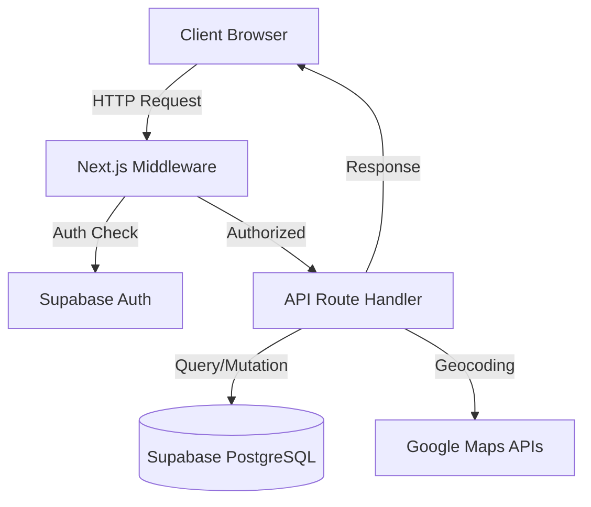
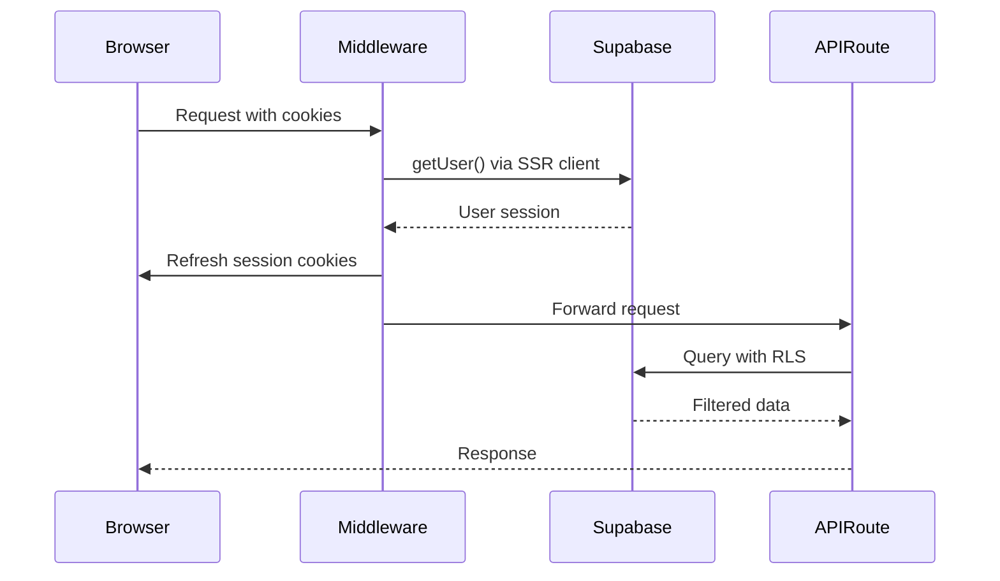
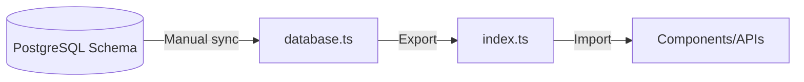

### RouteMax API Documentation

#### Overview

RouteMax API provides endpoints for client management, route planning, and optimization. All endpoints require authentication via Supabase Auth.

**Base URL**: `/api`
**Auth**: Supabase session cookie (handled by middleware)
**Content-Type**: `application/json`

---

#### Authentication

All API routes protected by @middleware.ts using Supabase Auth.

**Authentication Flow**:
1. User authenticates via Supabase Magic Link
2. Session stored in cookie
3. Middleware validates session on every request
4. `user_id` extracted from `auth.uid()`

**Unauthenticated Response**:
```json
{
  "error": "Unauthorized"
}
```
Status: `401`

---

#### Client Management

##### Import Clients

**Endpoint**: `POST /api/clients/import`

Import clients from CSV with automatic geocoding.

**Request Body**:
```typescript
{
  clients: Array<{
    name: string;
    address: string;
  }>
}
```

**Response** (200):
```typescript
{
  imported: number;
  failed: Array<{
    name: string;
    address: string;
    error: string;
  }>;
  clients: Client[];
}
```

**Client Type**:
```typescript
{
  id: string;
  name: string;
  address: string;
  lat: number;
  lng: number;
  is_active: boolean;
  created_at: string;
}
```

**Error Responses**:
- `400`: Invalid request body or schema validation failed
- `401`: User not authenticated
- `500`: Geocoding or database error

**Example**:
```bash
curl -X POST https://routemax.app/api/clients/import \
  -H "Content-Type: application/json" \
  -H "Cookie: sb-access-token=..." \
  -d '{
    "clients": [
      {"name": "Acme Corp", "address": "123 Main St, Paris"},
      {"name": "TechStart", "address": "456 Tech Blvd, Lyon"}
    ]
  }'
```

---

##### List Clients

**Endpoint**: `GET /api/clients`

Retrieve user's clients with pagination.

**Query Parameters**:
- `page` (optional, default: 1): Page number
- `limit` (optional, default: 50): Items per page
- `active_only` (optional, default: false): Filter active clients

**Response** (200):
```typescript
{
  clients: Client[];
  total: number;
  page: number;
  limit: number;
}
```

**Example**:
```bash
curl https://routemax.app/api/clients?page=1&limit=20&active_only=true \
  -H "Cookie: sb-access-token=..."
```

---

##### Update Client

**Endpoint**: `PUT /api/clients/[id]`

Update client information. Re-geocodes if address changed.

**Path Parameters**:
- `id`: Client UUID

**Request Body**:
```typescript
{
  name?: string;
  address?: string;
  is_active?: boolean;
}
```

**Response** (200):
```typescript
{
  client: Client;
}
```

**Error Responses**:
- `400`: Invalid input or validation failed
- `401`: Unauthorized
- `404`: Client not found or doesn't belong to user
- `500`: Geocoding or database error

**Example**:
```bash
curl -X PUT https://routemax.app/api/clients/123e4567-e89b-12d3 \
  -H "Content-Type: application/json" \
  -H "Cookie: sb-access-token=..." \
  -d '{"name": "Acme Corp Updated", "is_active": true}'
```

---

##### Delete Client

**Endpoint**: `DELETE /api/clients/[id]`

Soft-delete client (sets `is_active = false`).

**Path Parameters**:
- `id`: Client UUID

**Response** (200):
```typescript
{
  success: true;
}
```

**Error Responses**:
- `401`: Unauthorized
- `404`: Client not found
- `500`: Database error

**Example**:
```bash
curl -X DELETE https://routemax.app/api/clients/123e4567-e89b-12d3 \
  -H "Cookie: sb-access-token=..."
```

---

#### Route Planning

##### Suggest Clients

**Endpoint**: `POST /api/routes/suggest`

Get client suggestions based on route corridor using PostGIS spatial queries.

**Request Body**:
```typescript
{
  startLat: number;
  startLng: number;
  endLat: number;
  endLng: number;
  corridorRadiusKm: number; // default: 5
  maxSuggestions: number;   // default: 20
}
```

**Response** (200):
```typescript
{
  suggestions: SuggestedClient[];
}
```

**SuggestedClient Type**:
```typescript
{
  id: string;
  name: string;
  address: string;
  lat: number;
  lng: number;
  is_active: boolean;
  created_at: string;
  distanceFromRouteLine: number; // meters
  score: number; // 0-100, proximity-based
}
```

**Algorithm**:
1. Create LineString from start → end
2. Query clients within corridor radius using `ST_DWithin`
3. Calculate distance from route line with `ST_Distance`
4. Score based on proximity (closer = higher score)
5. Return top N suggestions ordered by score

**Error Responses**:
- `400`: Invalid coordinates or parameters
- `401`: Unauthorized
- `500`: PostGIS query error

**Example**:
```bash
curl -X POST https://routemax.app/api/routes/suggest \
  -H "Content-Type: application/json" \
  -H "Cookie: sb-access-token=..." \
  -d '{
    "startLat": 48.8566,
    "startLng": 2.3522,
    "endLat": 45.764,
    "endLng": 4.8357,
    "corridorRadiusKm": 10,
    "maxSuggestions": 15
  }'
```

---

##### Create Optimized Route

**Endpoint**: `POST /api/routes/optimize`

Generate optimized route using Google Routes API.

**Request Body**:
```typescript
{
  name: string;
  startAddress: string;
  startLat: number;
  startLng: number;
  startDatetime: string; // ISO 8601
  endAddress: string;
  endLat: number;
  endLng: number;
  endDatetime: string;   // ISO 8601
  clientIds: string[];   // UUIDs of clients to visit
  visitDurationMinutes?: number; // default: 20
}
```

**Response** (200):
```typescript
{
  route: Route;
  stops: RouteStop[];
}
```

**Route Type**:
```typescript
{
  id: string;
  name: string;
  startAddress: string;
  startLat: number;
  startLng: number;
  startDatetime: string;
  endAddress: string;
  endLat: number;
  endLng: number;
  endDatetime: string;
  totalDistanceKm: number | null;
  totalDurationMinutes: number | null;
  totalVisits: number;
  createdAt: string;
}
```

**RouteStop Type**:
```typescript
{
  id: string;
  clientId: string | null;
  clientName: string | null;
  address: string;
  lat: number;
  lng: number;
  stopOrder: number;
  estimatedArrival: string | null;
  estimatedDeparture: string | null;
  durationFromPrevious: number; // minutes
  distanceFromPrevious: number; // km
  visitDuration: number;        // minutes
  isIncluded: boolean;
}
```

**Process**:
1. Validate client IDs belong to user
2. Call Google Routes Optimization API
3. Insert route record
4. Insert route_stops with sequences
5. Return optimized route data

**Error Responses**:
- `400`: Invalid input, time window exceeded, or too many stops
- `401`: Unauthorized
- `403`: Client access denied
- `500`: Google API error or database error

**Example**:
```bash
curl -X POST https://routemax.app/api/routes/optimize \
  -H "Content-Type: application/json" \
  -H "Cookie: sb-access-token=..." \
  -d '{
    "name": "Monday Route",
    "startAddress": "10 Rue de Rivoli, Paris",
    "startLat": 48.8566,
    "startLng": 2.3522,
    "startDatetime": "2025-12-26T08:00:00Z",
    "endAddress": "20 Avenue des Champs-Élysées, Paris",
    "endLat": 48.8698,
    "endLng": 2.3078,
    "endDatetime": "2025-12-26T18:00:00Z",
    "clientIds": ["uuid1", "uuid2", "uuid3"],
    "visitDurationMinutes": 30
  }'
```

---

##### Get Route Details

**Endpoint**: `GET /api/routes/[id]`

Retrieve route with all stops.

**Path Parameters**:
- `id`: Route UUID

**Response** (200):
```typescript
{
  route: Route;
  stops: RouteStop[];
}
```

**Error Responses**:
- `401`: Unauthorized
- `404`: Route not found
- `500`: Database error

**Example**:
```bash
curl https://routemax.app/api/routes/123e4567-e89b-12d3 \
  -H "Cookie: sb-access-token=..."
```

---

##### List User Routes

**Endpoint**: `GET /api/routes/user`

Retrieve user's route history.

**Query Parameters**:
- `page` (optional, default: 1)
- `limit` (optional, default: 20)

**Response** (200):
```typescript
{
  routes: Route[];
  total: number;
  page: number;
  limit: number;
}
```

**Example**:
```bash
curl https://routemax.app/api/routes/user?page=1&limit=10 \
  -H "Cookie: sb-access-token=..."
```

---

##### Delete Route

**Endpoint**: `DELETE /api/routes/[id]`

Delete route and cascade-delete all stops.

**Path Parameters**:
- `id`: Route UUID

**Response** (200):
```typescript
{
  success: true;
}
```

**Error Responses**:
- `401`: Unauthorized
- `404`: Route not found
- `500`: Database error

**Example**:
```bash
curl -X DELETE https://routemax.app/api/routes/123e4567-e89b-12d3 \
  -H "Cookie: sb-access-token=..."
```

---

#### Utilities

##### Geocode Address

**Endpoint**: `POST /api/geocode`

Geocode single address using Google Geocoding API.

**Request Body**:
```typescript
{
  address: string;
}
```

**Response** (200):
```typescript
{
  address: string;          // original
  lat: number;
  lng: number;
  formattedAddress: string; // Google-formatted
}
```

**Error Responses**:
- `400`: Invalid or empty address
- `500`: Google API error
- `404`: Address not found

**Example**:
```bash
curl -X POST https://routemax.app/api/geocode \
  -H "Content-Type: application/json" \
  -d '{"address": "10 Rue de Rivoli, Paris"}'
```

**Note**: This endpoint does NOT require authentication (used in public forms).

---

#### Error Handling

All errors follow consistent format:

```typescript
{
  error: string;        // Human-readable message
  code?: string;        // Optional error code
  details?: unknown;    // Optional additional context
}
```

**HTTP Status Codes**:
- `200`: Success
- `400`: Bad Request (validation failed)
- `401`: Unauthorized (missing/invalid auth)
- `403`: Forbidden (authorized but not allowed)
- `404`: Not Found
- `500`: Internal Server Error

**Common Error Patterns**:
```typescript
// Validation error
{
  error: "Invalid request body",
  code: "VALIDATION_ERROR",
  details: { field: "startLat", message: "Must be a number" }
}

// Database error
{
  error: "Failed to fetch clients",
  code: "DATABASE_ERROR"
}

// External API error
{
  error: "Geocoding failed",
  code: "GOOGLE_API_ERROR",
  details: { status: "ZERO_RESULTS" }
}
```

---

#### Rate Limits

**Not implemented in MVP**. Future considerations:
- Google API quota limits apply
- Supabase connection pooling limits apply
- No explicit rate limiting per user

---

#### Validation

All endpoints use Zod for schema validation.

**Client Import Schema**:
```typescript
const importSchema = z.object({
  clients: z.array(
    z.object({
      name: z.string().min(1).max(255),
      address: z.string().min(1).max(500)
    })
  ).min(1).max(100)
});
```

**Route Creation Schema**:
```typescript
const routeSchema = z.object({
  name: z.string().min(1).max(255),
  startAddress: z.string().min(1),
  startLat: z.number().min(-90).max(90),
  startLng: z.number().min(-180).max(180),
  startDatetime: z.string().datetime(),
  endAddress: z.string().min(1),
  endLat: z.number().min(-90).max(90),
  endLng: z.number().min(-180).max(180),
  endDatetime: z.string().datetime(),
  clientIds: z.array(z.string().uuid()).min(1).max(25),
  visitDurationMinutes: z.number().min(5).max(120).optional()
});
```

---

#### Database Operations

All API routes use @lib/supabase/server.ts client with RLS enforcement.

**Access Pattern**:
```typescript
const supabase = createClient();
const { data, error } = await supabase
  .from('clients')
  .select('*')
  .eq('user_id', user.id); // RLS auto-filters
```

**RLS Guarantees**:
- Users can only access their own data
- No cross-user data leakage
- Enforced at database level

---

#### Google APIs Integration

##### Geocoding API
- **Endpoint**: `POST /api/geocode`
- **Usage**: Address → Coordinates
- **Quota**: Unlimited (pay-per-use)
- **Cost**: $5 per 1,000 requests

##### Routes Optimization API
- **Endpoint**: `POST /api/routes/optimize`
- **Usage**: Optimized route sequences
- **Quota**: Unlimited (pay-per-use)
- **Cost**: $10 per 1,000 optimizations
- **Limit**: 25 waypoints per route

**API Key**: `GOOGLE_MAPS_API_KEY_SERVER` (server-side only)

---

#### Implementation Status

**Current State**: API routes defined but NOT implemented.

**Planned Implementation Order**:
1. `POST /api/geocode` - Geocoding utility
2. `POST /api/clients/import` - CSV import
3. `GET /api/clients` - Client list
4. `PUT /api/clients/[id]` - Client update
5. `DELETE /api/clients/[id]` - Client delete
6. `POST /api/routes/suggest` - Client suggestions
7. `POST /api/routes/optimize` - Route creation
8. `GET /api/routes/[id]` - Route details
9. `GET /api/routes/user` - Route list
10. `DELETE /api/routes/[id]` - Route delete

**Testing**: See @docs/memory-bank/backend/TESTING.md

---

#### Related Documentation

- Database Schema: @docs/memory-bank/backend/DATABASE.md
- Type Definitions: @lib/types/index.ts, @lib/types/database.ts
- Project Structure: @docs/memory-bank/CODEBASE_STRUCTURE.md
- Supabase Config: @lib/supabase/


### Backend Architecture

#### Stack

- Next.js 15 App Router (API Routes)
- Supabase (PostgreSQL + PostGIS + Auth)
- Google Maps APIs (Geocoding, Routes, Places)
- TypeScript 5
- Zod 4 (validation)

#### Architecture Pattern

**Serverless API Routes** - Next.js App Router handles all backend operations through API routes at `@app/api/*`



#### API Routes Structure

Current structure (directories exist but no route handlers yet):

- `@app/api/clients/` - Client CRUD operations
- `@app/api/routes/` - Route planning and optimization
- `@app/api/geocode/` - Address geocoding utility

**WHY**: Next.js App Router convention - each directory represents a route segment

#### Authentication Flow



**WHY**: Supabase SSR handles session management across server/client boundary

##### Key Files

- `@middleware.ts` - Entry point, delegates to Supabase middleware
- `@lib/supabase/middleware.ts` - Session refresh logic using `@supabase/ssr`
- `@lib/supabase/server.ts` - Server-side Supabase client factory
- `@lib/supabase/client.ts` - Browser-side Supabase client factory

**WHY**: Separate clients prevent cookie access errors in different contexts

#### Database Layer

##### Tables

1. `clients` - User's client database
   - Geocoded addresses (lat/lng)
   - PostGIS geometry column for spatial queries
   - RLS enabled per user

2. `routes` - Saved route configurations
   - Start/end points with timestamps
   - Optimization metadata (JSONB)
   - RLS enabled per user

3. `route_stops` - Ordered stops per route
   - Links to clients or standalone addresses
   - Travel metrics (distance/duration)
   - RLS via route.user_id

**WHY**: Normalized schema separates concerns while maintaining referential integrity

##### PostGIS Integration

```sql
-- Geometry column auto-updated via trigger
ALTER TABLE clients ADD COLUMN geom GEOMETRY(Point, 4326);

-- Spatial index for fast proximity queries
CREATE INDEX idx_clients_geom ON clients USING GIST(geom);
```

**WHY**: PostGIS enables efficient corridor search for client suggestions along routes

#### Type Safety



- `@lib/types/database.ts` - Supabase table types (Row/Insert/Update)
- `@lib/types/index.ts` - Application domain types

**WHY**: TypeScript strict mode requires explicit types; manual sync needed (no auto-gen configured)

#### External API Integration

##### Google Maps Services

Planned integrations (not yet implemented):

- **Geocoding API** - Convert addresses to coordinates
- **Routes Optimization API** - Multi-stop route optimization
- **Places API** - Address autocomplete

Package: `@googlemaps/google-maps-services-js` v3

**WHY**: Server-side API key separation prevents client exposure

#### Request/Response Flow

##### Typical API Route Pattern

```typescript
// 1. Auth check (automatic via middleware)
// 2. Get Supabase client with user context
const supabase = await createClient()

// 3. Parse/validate request
const body = await request.json()
// Zod validation here

// 4. Database operation (RLS auto-filters by user_id)
const { data, error } = await supabase
  .from('clients')
  .select('*')

// 5. Error handling
if (error) throw error

// 6. Return JSON response
return Response.json(data)
```

**WHY**: Middleware handles auth, RLS handles authorization - no manual user_id checks needed

#### Security Architecture

##### Row Level Security (RLS)

All tables have policies enforcing `auth.uid() = user_id`:

```sql
CREATE POLICY "Users can view their own clients"
  ON clients FOR SELECT
  USING (auth.uid() = user_id);
```

**WHY**: Database-level security prevents privilege escalation bugs

##### API Keys

- `NEXT_PUBLIC_GOOGLE_MAPS_API_KEY` - Browser (domain-restricted)
- `GOOGLE_MAPS_API_KEY_SERVER` - Server (IP-restricted)
- `NEXT_PUBLIC_SUPABASE_ANON_KEY` - Public (RLS protected)

**WHY**: Separate keys limit blast radius if exposed

#### Data Validation

Zod 4 schemas for:
- Request body validation
- Response type safety
- CSV import parsing

**WHY**: Runtime validation catches malformed data before database operations

#### Performance Considerations

##### Indexes

- `idx_clients_user_id` - Filter by user
- `idx_clients_active` - Active clients only
- `idx_clients_geom` - Spatial queries (GIST)
- `idx_routes_created_at` - Recent routes first

**WHY**: Optimize common query patterns (user filtering, spatial search, sorting)

##### Triggers

- `update_clients_updated_at` - Auto-timestamp on update
- `trigger_update_client_geom` - Sync geometry with lat/lng changes

**WHY**: Maintain data consistency without application-level logic

#### Error Handling

Planned pattern:
- Try-catch all async operations
- Return structured error responses
- Log errors server-side
- User-friendly messages client-side

**WHY**: Prevent unhandled promise rejections and expose minimal error details

#### Cost Management

##### Google Routes Optimization API

- $10 per 1,000 optimizations
- Budget alerts: $50, $100, $200
- Projected: $20/month (100 users, 5 routes/week each)

**WHY**: Monitor usage to prevent surprise bills; optimize API calls

#### Development Status

Current state: **Infrastructure Ready, No Route Handlers**

- API directory structure created
- Database schema deployed
- Auth middleware configured
- Type definitions complete
- No actual API endpoints implemented yet

Next: Implement route handlers starting with `POST /api/clients/import`


### Backend Coding Assertions

#### API Route Patterns

##### Route Handler Structure
- Next.js 15 App Router API routes: `/app/api/[feature]/route.ts`
- Named exports: `GET`, `POST`, `PUT`, `DELETE`, `PATCH`
- Function signature: `async function GET(request: NextRequest)`
- Return type: `NextResponse` or `Response`

##### Response Conventions
- Success: `NextResponse.json({ data }, { status: 200 })`
- Created: `NextResponse.json({ data }, { status: 201 })`
- Error: `NextResponse.json({ error: string }, { status: 4xx/5xx })`
- Always return JSON, never plain text

#### TypeScript Usage

##### Strict Mode Enabled
- `tsconfig.json` has `"strict": true`
- All function parameters must have explicit types
- No implicit `any` types allowed
- Use `!` assertion only for verified env vars: `process.env.VAR!`

##### Type Imports
- Database types: `import { Database } from '@/lib/types/database'`
- Domain types: `import { Client, Route, RouteStop } from '@/lib/types'`
- Supabase client type: `createServerClient<Database>(...)`
- Next types: `import { type NextRequest } from 'next/server'`

##### Database Type Patterns
- Table Row: `Database['public']['Tables']['clients']['Row']`
- Insert: `Database['public']['Tables']['clients']['Insert']`
- Update: `Database['public']['Tables']['clients']['Update']`
- Use domain types for frontend, database types for backend

#### Error Handling

##### Server-Side Errors
- Wrap async operations in try-catch blocks
- Silent catch only for Server Components: `catch { /* Server Component */ }`
- API routes: always return error JSON, never throw to client
- Log errors before returning response (when logging implemented)

##### Error Response Format
```typescript
NextResponse.json(
  { error: 'Clear user-facing message' },
  { status: 400 | 401 | 403 | 404 | 500 }
)
```

##### Status Code Usage
- `400` - Invalid request data
- `401` - Unauthenticated
- `403` - Unauthorized (authenticated but not allowed)
- `404` - Resource not found
- `500` - Internal server error

#### Validation Patterns

##### Zod Schema Location
- Define schemas at top of route file or in separate schema file
- Import: `import { z } from 'zod'`
- Parse before using: `const data = schema.parse(await request.json())`

##### Validation Example
```typescript
const createClientSchema = z.object({
  name: z.string().min(1),
  address: z.string().min(1),
  lat: z.number().min(-90).max(90),
  lng: z.number().min(-180).max(180)
});

// In route handler
const body = createClientSchema.parse(await request.json());
```

##### Error Handling
- Zod parse failures: catch `ZodError` → `400` response
- Return first error: `error.errors[0].message`

#### Async/Await Patterns

##### Supabase Queries
- Always `await` Supabase operations
- Chain `.select()`, `.insert()`, `.update()`, `.delete()`
- Check for errors: `const { data, error } = await supabase.from(...)`
- Early return on error: `if (error) return NextResponse.json(...)`

##### Server Client Creation
```typescript
import { createClient } from '@/lib/supabase/server';

export async function GET(request: NextRequest) {
  const supabase = await createClient(); // await required
  const { data, error } = await supabase.from('clients').select();
  // ...
}
```

##### No Client Components in API Routes
- Never use `'use client'` in API routes
- Use `cookies()` from `next/headers` (async in Next 15)
- No React hooks in route handlers

#### Authentication Patterns

##### User ID Retrieval
```typescript
const { data: { user } } = await supabase.auth.getUser();
if (!user) return NextResponse.json({ error: 'Unauthorized' }, { status: 401 });
const userId = user.id;
```

##### RLS Enforcement
- Database enforces RLS policies
- Always filter by `user_id` in queries for redundancy
- Trust RLS for security, explicit filters for clarity

#### Database Query Patterns

##### Row Level Security
- All tables have RLS enabled
- Policies enforce `auth.uid() = user_id`
- No manual user_id filtering needed (but recommended for clarity)

##### Insert Pattern
```typescript
const { data, error } = await supabase
  .from('clients')
  .insert({ user_id: userId, name, address, lat, lng })
  .select()
  .single();
```

##### Update Pattern
```typescript
const { data, error } = await supabase
  .from('clients')
  .update({ name, address })
  .eq('id', clientId)
  .select()
  .single();
```

##### Delete Pattern
```typescript
const { error } = await supabase
  .from('clients')
  .delete()
  .eq('id', clientId);
```

##### Query Pattern
```typescript
const { data, error } = await supabase
  .from('clients')
  .select('*')
  .eq('user_id', userId)
  .eq('is_active', true)
  .order('created_at', { ascending: false });
```

#### Environment Variables

##### Required Vars
- `NEXT_PUBLIC_SUPABASE_URL` - Supabase project URL
- `NEXT_PUBLIC_SUPABASE_ANON_KEY` - Supabase anon key
- `GOOGLE_MAPS_API_KEY` - Server-side Google Maps key (not NEXT_PUBLIC)

##### Usage Pattern
```typescript
// Client-safe (NEXT_PUBLIC prefix)
process.env.NEXT_PUBLIC_SUPABASE_URL!

// Server-only (no prefix)
process.env.GOOGLE_MAPS_API_KEY!
```

##### Validation
- Use `!` assertion for required vars defined in `.env.local`
- Consider runtime validation for critical vars

#### Import Patterns

##### Path Aliases
- Use `@/` prefix for all imports: `import { createClient } from '@/lib/supabase/server'`
- Never use relative paths: `../../lib/...`
- Configured in `tsconfig.json`: `"@/*": ["./*"]`

##### Import Order (Convention)
1. Next.js imports
2. Third-party imports
3. Type imports
4. Local imports (lib, components, types)

#### Middleware Conventions

##### Auth Middleware
- Defined in `/middleware.ts`
- Runs on all routes except static assets
- Uses `@/lib/supabase/middleware` updateSession
- No custom auth logic, delegate to Supabase

##### Route Matcher
```typescript
export const config = {
  matcher: [
    '/((?!_next/static|_next/image|favicon.ico|.*\\.(?:svg|png|jpg|jpeg|gif|webp)$).*)',
  ],
};
```

#### Performance Patterns

##### Database Indexes
- Leverage existing indexes: `idx_clients_user_id`, `idx_clients_active`
- Query with indexed columns: `.eq('user_id', userId)`
- Order by indexed columns for performance

##### Caching
- No caching implemented yet
- Future: use Next.js `revalidatePath()` for data mutations
- Avoid client-side data caching (Supabase client handles)

#### API Design Patterns

##### RESTful Conventions
- `GET /api/clients` - List all
- `GET /api/clients/[id]` - Get one
- `POST /api/clients` - Create
- `PUT /api/clients/[id]` - Update
- `DELETE /api/clients/[id]` - Delete

##### Request Body
- Parse with `await request.json()`
- Validate with Zod before using
- Return 400 on parse failures

##### URL Parameters
- Dynamic routes: `/api/clients/[id]/route.ts`
- Access via: `params.id` (destructure from second arg)
- Validate params exist before using

##### Response Body
- Success: `{ data: T }` or `{ data: T[] }`
- Error: `{ error: string }`
- Never mix data and error in same response


### RouteMax Database Schema

#### Overview

RouteMax uses **Supabase (PostgreSQL)** with **PostGIS** extension for spatial queries and route optimization.

**Migrations**: @supabase/migrations/

#### Schema Diagram

```
auth.users (Supabase Auth)
    ↓
clients (geocoded customer locations)
    ↓
routes (optimized delivery routes)
    ↓
route_stops (ordered stops with timing)
```

#### Tables

##### `clients`

Customer locations with geocoding and spatial data.

**Columns:**
- `id` UUID (PK)
- `user_id` UUID (FK → auth.users)
- `name` TEXT
- `address` TEXT
- `lat` FLOAT
- `lng` FLOAT
- `geom` GEOMETRY(Point, 4326) - PostGIS spatial column
- `geocoded_at` TIMESTAMP
- `is_active` BOOLEAN
- `created_at` TIMESTAMP
- `updated_at` TIMESTAMP

**Indexes:**
- `idx_clients_user_id` on `user_id`
- `idx_clients_active` on `user_id, is_active`
- `idx_clients_geom` GIST spatial index on `geom`

**Triggers:**
- `update_clients_updated_at` - auto-updates `updated_at`
- `trigger_update_client_geom` - auto-syncs `geom` from `lat`/`lng`

**RLS Policies:**
- Users can only CRUD their own clients (scoped by `user_id`)

---

##### `routes`

Optimized delivery routes with start/end points and metadata.

**Columns:**
- `id` UUID (PK)
- `user_id` UUID (FK → auth.users)
- `name` TEXT
- `start_address` TEXT
- `start_lat` FLOAT
- `start_lng` FLOAT
- `start_datetime` TIMESTAMP
- `end_address` TEXT
- `end_lat` FLOAT
- `end_lng` FLOAT
- `end_datetime` TIMESTAMP
- `total_distance_km` FLOAT
- `total_duration_minutes` INTEGER
- `total_visits` INTEGER
- `optimization_metadata` JSONB - stores algorithm results
- `created_at` TIMESTAMP
- `updated_at` TIMESTAMP

**Indexes:**
- `idx_routes_user_id` on `user_id`
- `idx_routes_created_at` on `user_id, created_at DESC`

**Triggers:**
- `update_routes_updated_at` - auto-updates `updated_at`

**RLS Policies:**
- Users can only CRUD their own routes (scoped by `user_id`)

---

##### `route_stops`

Individual stops in a route with ordering and timing estimates.

**Columns:**
- `id` UUID (PK)
- `route_id` UUID (FK → routes, CASCADE delete)
- `client_id` UUID (FK → clients, SET NULL on delete)
- `address` TEXT
- `lat` FLOAT
- `lng` FLOAT
- `stop_order` INTEGER - sequence in route
- `estimated_arrival` TIMESTAMP
- `estimated_departure` TIMESTAMP
- `duration_from_previous_minutes` INTEGER
- `distance_from_previous_km` FLOAT
- `visit_duration_minutes` INTEGER (default: 20)
- `is_included` BOOLEAN - for route exclusions
- `created_at` TIMESTAMP

**Indexes:**
- `idx_route_stops_route_id` on `route_id, stop_order`
- `idx_route_stops_client_id` on `client_id`

**RLS Policies:**
- Users can CRUD stops only for routes they own (via JOIN with `routes.user_id`)

---

#### PostGIS Spatial Features

##### Extension Setup
@supabase/migrations/002_enable_postgis.sql

```sql
CREATE EXTENSION IF NOT EXISTS postgis;
```

##### Spatial Column: `clients.geom`

- **Type**: `GEOMETRY(Point, 4326)`
- **SRID**: 4326 (WGS 84 - standard GPS coordinates)
- **Index**: GIST for fast spatial queries

##### Auto-sync Trigger

```sql
CREATE OR REPLACE FUNCTION update_client_geom()
RETURNS TRIGGER AS $$
BEGIN
    NEW.geom = ST_SetSRID(ST_MakePoint(NEW.lng, NEW.lat), 4326);
    RETURN NEW;
END;
$$ LANGUAGE plpgsql;
```

**Fired on**: INSERT or UPDATE of `lat`/`lng` columns

##### Common Spatial Queries

**Find clients within radius:**
```sql
SELECT * FROM clients
WHERE ST_DWithin(
  geom::geography,
  ST_SetSRID(ST_MakePoint($lng, $lat), 4326)::geography,
  $radius_meters
);
```

**Calculate distance between points:**
```sql
SELECT ST_Distance(
  geom1::geography,
  geom2::geography
) AS distance_meters;
```

**Nearest neighbors:**
```sql
SELECT * FROM clients
ORDER BY geom <-> ST_SetSRID(ST_MakePoint($lng, $lat), 4326)
LIMIT 10;
```

---

#### Row Level Security (RLS)

**All tables** have RLS enabled with user-scoped policies.

##### Policy Pattern: `clients` and `routes`
- Direct `user_id` check: `auth.uid() = user_id`
- Applied to: SELECT, INSERT, UPDATE, DELETE

##### Policy Pattern: `route_stops`
- Indirect via JOIN: Check if parent route belongs to user
```sql
EXISTS (
  SELECT 1 FROM routes
  WHERE routes.id = route_stops.route_id
  AND routes.user_id = auth.uid()
)
```

**Security guarantee**: Users cannot access data owned by other users.

---

#### Access Patterns

##### 1. Client Management
```sql
-- List active clients for user
SELECT * FROM clients
WHERE user_id = auth.uid() AND is_active = true
ORDER BY name;

-- Spatial proximity search
SELECT * FROM clients
WHERE ST_DWithin(
  geom::geography,
  ST_SetSRID(ST_MakePoint($lng, $lat), 4326)::geography,
  5000 -- 5km radius
);
```

##### 2. Route Creation
```sql
-- Insert route with metadata
INSERT INTO routes (user_id, name, start_lat, start_lng, ...)
VALUES (auth.uid(), 'Morning Route', ...);

-- Bulk insert stops
INSERT INTO route_stops (route_id, client_id, stop_order, ...)
SELECT ... FROM unnest($stops);
```

##### 3. Route Retrieval
```sql
-- Get route with all stops
SELECT
  r.*,
  json_agg(rs.* ORDER BY rs.stop_order) AS stops
FROM routes r
LEFT JOIN route_stops rs ON r.id = rs.route_id
WHERE r.user_id = auth.uid() AND r.id = $route_id
GROUP BY r.id;
```

##### 4. Analytics
```sql
-- Total distance by user
SELECT SUM(total_distance_km) FROM routes
WHERE user_id = auth.uid();

-- Most visited clients
SELECT c.name, COUNT(rs.id) AS visit_count
FROM clients c
JOIN route_stops rs ON c.id = rs.client_id
JOIN routes r ON rs.route_id = r.id
WHERE r.user_id = auth.uid()
GROUP BY c.id, c.name
ORDER BY visit_count DESC;
```

---

#### Performance Optimizations

##### Indexes
- **Composite**: `(user_id, is_active)` for filtered client lists
- **Spatial GIST**: Fast proximity searches on `clients.geom`
- **Ordering**: `(user_id, created_at DESC)` for recent routes
- **Foreign keys**: `route_id, stop_order` for stop retrieval

##### Triggers
- Auto-maintain `updated_at` on changes
- Auto-sync `geom` from `lat`/`lng` changes
- No manual geometry updates needed

##### JSONB Metadata
- `routes.optimization_metadata` stores algorithm parameters
- Allows flexible schema for different optimization strategies
- No additional tables needed for algorithm-specific data

---

#### Migration Order

1. **001_create_clients_table.sql** - Base client data with RLS
2. **002_enable_postgis.sql** - Spatial extension + geometry column
3. **003_create_routes_table.sql** - Routes with metadata
4. **004_create_route_stops_table.sql** - Stop sequences with cascade deletes

**Cascades**:
- Delete user → Delete all clients/routes
- Delete route → Delete all route_stops
- Delete client → Set `route_stops.client_id` to NULL (preserve historical stops)


### Backend Testing

#### Current State

No test infrastructure exists. API routes defined but not implemented:
- @app/api/clients
- @app/api/geocode
- @app/api/routes

#### Testing Guidelines (from project standards)

##### Test-First Approach
- Write tests first for bug fixes
- Never mock functional components

##### API Testing Standards
- Test API endpoints as integration tests
- Validate request/response schemas with Zod
- Test error handling explicitly
- No silent errors - throw early

##### Structure Principles
- Keep tests small and focused
- Express intent through naming
- Make dependencies explicit
- Minimize state and side effects

#### Recommended Setup

##### Testing Stack
- Next.js built-in testing (when configured)
- Zod for schema validation
- Test API routes against actual Supabase test database

##### Testing Patterns
```typescript
// API route test structure
describe('POST /api/routes', () => {
  it('creates route with valid data', async () => {
    // Arrange: prepare request
    // Act: call API
    // Assert: verify response + side effects
  })

  it('rejects invalid schema', async () => {
    // Test Zod validation
  })
})
```

##### Coverage Focus
1. Schema validation (Zod)
2. Error handling
3. Database operations
4. Business logic

#### Status
Testing infrastructure not yet implemented. Follow guidelines when adding tests.
