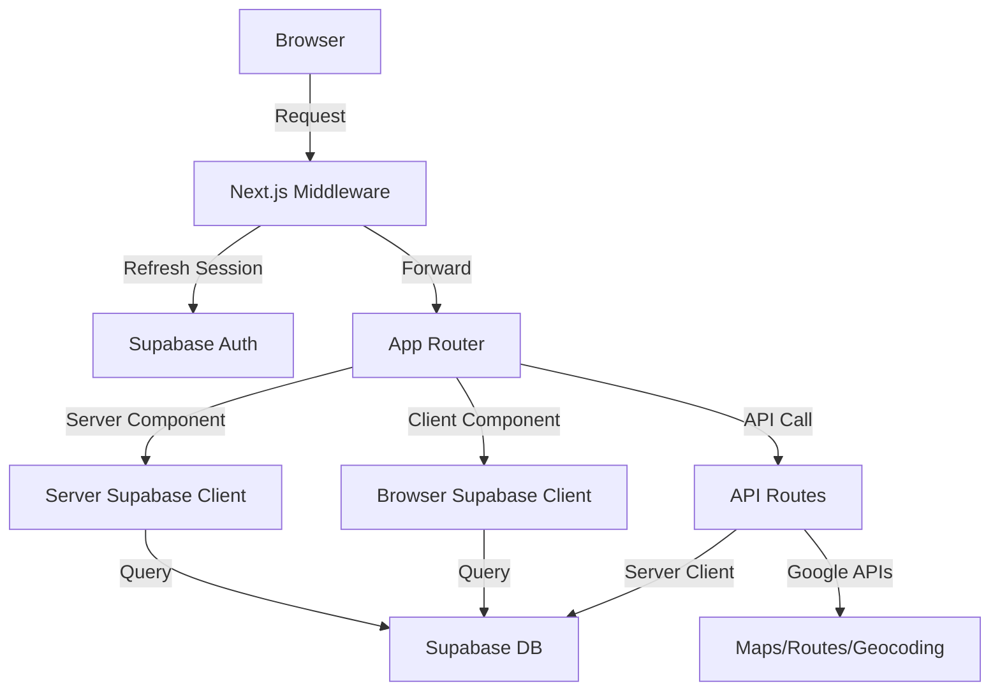
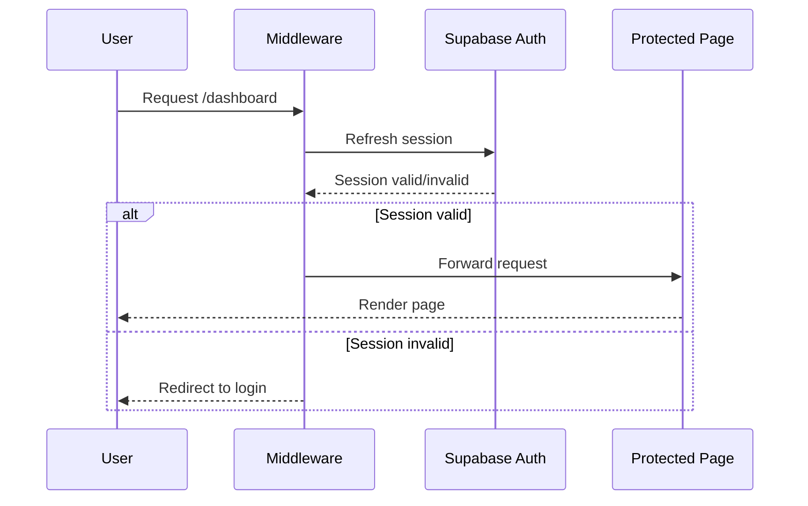

### Frontend Architecture

#### Tech Stack

- Next.js 15 (App Router)
- React 19
- TypeScript 5 (strict mode)
- Tailwind CSS 4
- Supabase (auth + database)
- Google Maps APIs (@react-google-maps/api)

#### Directory Structure

```
app/
├── api/                    # API Routes (Server-side)
│   ├── clients/           # Client management endpoints
│   ├── routes/            # Route optimization endpoints
│   └── geocode/           # Geocoding utility endpoint
├── dashboard/             # Protected app pages
│   ├── clients/           # Client management UI
│   └── routes/            # Route planning UI
├── layout.tsx             # Root layout (Server Component)
├── page.tsx               # Landing page (Server Component)
└── globals.css            # Global styles

components/                # React Components
├── clients/               # Client-related components
├── routes/                # Route-related components
└── ui/                    # Shared UI components

lib/
├── supabase/
│   ├── client.ts          # Browser client (Client Components)
│   ├── server.ts          # Server client (Server Components)
│   └── middleware.ts      # Auth session management
├── types/
│   ├── database.ts        # Supabase generated types
│   └── index.ts           # App domain types
└── utils/                 # Helper functions

middleware.ts              # Next.js middleware (auth)
```

#### Architecture Patterns

##### Next.js App Router

- Default to Server Components for data fetching
- Use Client Components only when needed (interactivity, hooks)
- API Routes for backend operations (auth-protected)
- Middleware for session refresh on every request

##### Data Flow



##### Component Architecture

- **Server Components** (default)
  - Data fetching from Supabase
  - No client-side JavaScript
  - Direct database access via @lib/supabase/server

- **Client Components** (`"use client"`)
  - User interactions
  - React hooks (useState, useEffect)
  - Browser APIs
  - Access database via @lib/supabase/client

##### Supabase Integration

- **Three client types**
  - Browser client: @lib/supabase/client (Client Components)
  - Server client: @lib/supabase/server (Server Components, API Routes)
  - Middleware client: @lib/supabase/middleware (session refresh)

- **Authentication flow**
  - Middleware refreshes session on every request
  - Cookies managed via Next.js cookie API
  - RLS policies enforce data access

- **Type safety**
  - Database types in @lib/types/database
  - Generated from Supabase schema
  - Used for all client instances

#### Key Design Decisions

##### WHY App Router over Pages Router
- Server Components reduce client bundle size
- Built-in data fetching patterns
- Simplified routing with file-system
- Better SEO with default SSR

##### WHY Supabase SSR Package
- Cookie-based session management
- Compatible with Next.js middleware
- Automatic session refresh
- Secure auth state across server/client

##### WHY Separate API Routes
- Centralize business logic
- Protect API keys (Google Maps server key)
- Enable server-side validation with Zod
- Reusable across different UI components

##### WHY TypeScript Strict Mode
- Catch errors at compile time
- Type-safe database queries
- Better IDE autocomplete
- Enforces null checks

##### WHY Minimal Client Components
- Faster initial page load
- Better SEO
- Reduced JavaScript bundle
- Use only when needed (forms, maps, interactions)

#### State Management

- **No global state library** (Redux, Zustand)
- Server Components fetch fresh data
- Client Components use React state (useState)
- URL state for pagination/filters
- Supabase real-time for live updates (future)

#### Routing Strategy

```
/                          # Landing page (public)
/dashboard/clients         # Client list (protected)
/dashboard/routes          # Route planning (protected)
/api/clients/import        # CSV import endpoint
/api/routes/suggest        # Client suggestions
/api/routes/optimize       # Route optimization
```

#### Authentication Flow



#### API Route Pattern

All API routes follow this structure:

```typescript
// app/api/[resource]/route.ts
import { createClient } from '@/lib/supabase/server';

export async function POST(request: Request) {
  // 1. Auth check
  const supabase = await createClient();
  const { data: { user } } = await supabase.auth.getUser();
  if (!user) return Response.json({ error: 'Unauthorized' }, { status: 401 });

  // 2. Parse and validate input
  const body = await request.json();
  const validated = schema.parse(body); // Zod

  // 3. Business logic
  const result = await doSomething(validated);

  // 4. Return response
  return Response.json(result);
}
```

#### Data Access Patterns

##### Server Component
```typescript
import { createClient } from '@/lib/supabase/server';

export default async function Page() {
  const supabase = await createClient();
  const { data } = await supabase.from('clients').select();
  return <List clients={data} />;
}
```

##### Client Component
```typescript
'use client';
import { createClient } from '@/lib/supabase/client';

export function ClientList() {
  const [clients, setClients] = useState([]);
  const supabase = createClient();

  useEffect(() => {
    supabase.from('clients').select()
      .then(({ data }) => setClients(data));
  }, []);

  return <ul>{clients.map(...)}</ul>;
}
```

##### API Route Call
```typescript
'use client';

async function importClients(file: File) {
  const formData = new FormData();
  formData.append('file', file);

  const response = await fetch('/api/clients/import', {
    method: 'POST',
    body: formData,
  });

  return response.json();
}
```

#### Error Handling

- All async operations wrapped in try-catch
- API routes return proper HTTP status codes
- Client-side errors shown via `sonner` toast
- Server errors logged to console (Vercel logs)

#### Performance Strategies

- Server Components for static content
- Dynamic imports for large client components
- Google Maps lazy loading
- Database queries use indexes
- Pagination for large lists

#### Security Measures

- RLS policies on all tables
- API keys in environment variables
- Server-only API key (Google Maps)
- CSRF protection via Supabase
- Input validation with Zod

#### Environment Configuration

```env
### Public (exposed to browser)
NEXT_PUBLIC_SUPABASE_URL
NEXT_PUBLIC_SUPABASE_ANON_KEY
NEXT_PUBLIC_GOOGLE_MAPS_API_KEY
NEXT_PUBLIC_APP_URL

### Private (server-only)
GOOGLE_MAPS_API_KEY_SERVER
GOOGLE_CLOUD_PROJECT_ID
```

#### Future Considerations

- Real-time updates with Supabase subscriptions
- Optimistic UI updates
- Client-side caching (React Query)
- Progressive Web App (PWA)
- Offline support


### Frontend-Backend Communication

#### Overview

RouteMax uses **Supabase** for database operations with Next.js 15 App Router. No REST API routes are currently implemented - all data access is via Supabase client.

#### Authentication

##### Supabase Auth Flow

**Client Setup**: @lib/supabase/client.ts
```typescript
import { createClient } from '@/lib/supabase/client'

const supabase = createClient()
```

**Server Setup**: @lib/supabase/server.ts
```typescript
import { createClient } from '@/lib/supabase/server'

const supabase = await createClient()
```

**Middleware**: @middleware.ts + @lib/supabase/middleware.ts
- Runs on every request (except static assets)
- Validates and refreshes auth session
- Updates auth cookies via `supabase.auth.getUser()`

##### Auth Patterns

**Client-side:**
```typescript
// Sign in
const { data, error } = await supabase.auth.signInWithPassword({
  email,
  password
})

// Get current user
const { data: { user } } = await supabase.auth.getUser()

// Sign out
await supabase.auth.signOut()
```

**Server-side:**
```typescript
// In Server Component or Route Handler
const supabase = await createClient()
const { data: { user } } = await supabase.auth.getUser()

if (!user) {
  redirect('/login')
}
```

---

#### Data Access Patterns

##### Direct Supabase Queries

All database operations use Supabase client directly (no API routes).

**Type Safety**: @lib/types/database.ts
```typescript
import { Database } from '@/lib/types/database'

// Typed table access
type Client = Database['public']['Tables']['clients']['Row']
type ClientInsert = Database['public']['Tables']['clients']['Insert']
```

##### Common Query Patterns

**Fetch all clients:**
```typescript
const { data, error } = await supabase
  .from('clients')
  .select('*')
  .eq('is_active', true)
  .order('name')
```

**Insert client:**
```typescript
const { data, error } = await supabase
  .from('clients')
  .insert({
    name: 'Customer Name',
    address: '123 Street',
    lat: 40.7128,
    lng: -74.0060,
    user_id: user.id
  })
  .select()
  .single()
```

**Update client:**
```typescript
const { error } = await supabase
  .from('clients')
  .update({ is_active: false })
  .eq('id', clientId)
```

**Delete client:**
```typescript
const { error } = await supabase
  .from('clients')
  .delete()
  .eq('id', clientId)
```

**Fetch route with stops (JOIN):**
```typescript
const { data, error } = await supabase
  .from('routes')
  .select(`
    *,
    route_stops (
      *,
      clients (name, address)
    )
  `)
  .eq('id', routeId)
  .single()
```

---

#### Error Handling

##### Supabase Error Pattern

```typescript
const { data, error } = await supabase
  .from('clients')
  .select('*')

if (error) {
  console.error('Database error:', error.message)
  // Handle error (toast notification, etc.)
  return
}

// Use data safely
```

##### Auth Errors

```typescript
const { error } = await supabase.auth.signInWithPassword({
  email,
  password
})

if (error) {
  if (error.message.includes('Invalid login credentials')) {
    // Show user-friendly message
  }
}
```

##### RLS Policy Errors

```typescript
// Error when user tries to access another user's data
// RLS policies automatically return empty results or errors
const { data, error } = await supabase
  .from('clients')
  .select('*')
  .eq('user_id', otherUserId) // Will fail due to RLS

// Error: "new row violates row-level security policy"
```

---

#### API Routes (Placeholder)

##### Structure

Current empty API directories:
- @app/api/clients/
- @app/api/geocode/
- @app/api/routes/

##### Future Route Handler Pattern

**Expected pattern** (when implemented):

```typescript
// app/api/geocode/route.ts
export async function POST(request: Request) {
  const supabase = await createClient()

  // Verify auth
  const { data: { user } } = await supabase.auth.getUser()
  if (!user) {
    return Response.json({ error: 'Unauthorized' }, { status: 401 })
  }

  const body = await request.json()

  // Process request
  // ...

  return Response.json({ data: result })
}
```

---

#### Client Components

##### "use client" Pattern

**Not yet implemented**, but expected usage:

```typescript
'use client'

import { useEffect, useState } from 'react'
import { createClient } from '@/lib/supabase/client'

export function ClientList() {
  const [clients, setClients] = useState<Client[]>([])
  const supabase = createClient()

  useEffect(() => {
    const fetchClients = async () => {
      const { data, error } = await supabase
        .from('clients')
        .select('*')
        .eq('is_active', true)

      if (!error && data) {
        setClients(data)
      }
    }

    fetchClients()
  }, [])

  return (
    <ul>
      {clients.map(client => (
        <li key={client.id}>{client.name}</li>
      ))}
    </ul>
  )
}
```

##### Realtime Subscriptions

**Pattern for live updates:**

```typescript
'use client'

useEffect(() => {
  const channel = supabase
    .channel('clients-changes')
    .on(
      'postgres_changes',
      {
        event: '*',
        schema: 'public',
        table: 'clients',
        filter: `user_id=eq.${user.id}`
      },
      (payload) => {
        // Update state based on payload
        console.log('Change received!', payload)
      }
    )
    .subscribe()

  return () => {
    supabase.removeChannel(channel)
  }
}, [])
```

---

#### Server Actions (Expected)

##### "use server" Pattern

**Not yet implemented**, but expected for mutations:

```typescript
'use server'

import { createClient } from '@/lib/supabase/server'
import { revalidatePath } from 'next/cache'

export async function createClient(formData: FormData) {
  const supabase = await createClient()

  const { data: { user } } = await supabase.auth.getUser()
  if (!user) throw new Error('Unauthorized')

  const { error } = await supabase
    .from('clients')
    .insert({
      name: formData.get('name') as string,
      address: formData.get('address') as string,
      user_id: user.id,
      // lat/lng from geocoding
    })

  if (error) throw error

  revalidatePath('/clients')
}
```

**Usage in Client Component:**

```typescript
'use client'

import { createClient } from '@/actions/clients'

export function NewClientForm() {
  return (
    <form action={createClient}>
      <input name="name" required />
      <input name="address" required />
      <button type="submit">Create Client</button>
    </form>
  )
}
```

---

#### Request/Response Types

##### Database Types

**Auto-generated**: @lib/types/database.ts

```typescript
export interface Database {
  public: {
    Tables: {
      clients: {
        Row: { id: string; user_id: string; name: string; ... }
        Insert: { id?: string; user_id: string; name: string; ... }
        Update: { id?: string; user_id?: string; ... }
      }
      routes: { ... }
      route_stops: { ... }
    }
  }
}
```

**Usage:**

```typescript
import type { Database } from '@/lib/types/database'

type Client = Database['public']['Tables']['clients']['Row']
type NewClient = Database['public']['Tables']['clients']['Insert']

const client: Client = await supabase.from('clients').select('*').single()
```

---

#### Security

##### Row Level Security (RLS)

All queries automatically scoped by RLS policies:

**Clients/Routes:**
- Policy: `auth.uid() = user_id`
- Users can only CRUD their own data

**Route Stops:**
- Policy: Checks parent route ownership via JOIN
- Users can only access stops for their own routes

##### NEVER bypass RLS

```typescript
// ❌ WRONG - Don't use service role client in user-facing code
const supabase = createClient(url, serviceRoleKey)

// ✅ CORRECT - Use auth-scoped client
const supabase = await createClient() // Uses auth cookies
```

---

#### Current State

**No API routes implemented yet**. All future data access will use:

1. **Direct Supabase queries** for reads (Server/Client Components)
2. **Server Actions** for mutations (forms, optimistic updates)
3. **API Routes** only for:
   - External API calls (Google Maps geocoding)
   - Complex business logic
   - Webhook handlers

**Next steps:**
- Implement client management components
- Add geocoding API route
- Build route optimization logic
- Add real-time route tracking


### Frontend Coding Assertions

#### Stack
- Next.js 15.1.5 (App Router)
- React 19.0.0
- TypeScript 5 (strict mode)
- Tailwind CSS 4.0.0
- Supabase (SSR)

#### Naming Conventions

##### Files & Directories
- Route files: lowercase `page.tsx`, `layout.tsx`
- Components: empty directories exist (`components/ui`, `components/clients`, `components/routes`)
- Config files: lowercase with extension `next.config.ts`, `tailwind.config.ts`
- Middleware: `middleware.ts` at root
- API routes: nested under `app/api/*`

##### TypeScript
- Interfaces: PascalCase `Database`, `Client`, `Route`, `RouteStop`
- Types: exported via `export type { Database }`
- Functions: camelCase `createClient()`, `updateSession()`
- Database fields: snake_case `user_id`, `created_at`, `is_active`
- Application fields: camelCase `startAddress`, `totalDistanceKm`, `clientName`

#### File Organization

##### Structure
```
/app
  /layout.tsx          # Root layout
  /page.tsx            # Home page
  /dashboard/*         # Dashboard routes (empty)
  /api/*               # API routes (empty)
/lib
  /types
    /database.ts       # Supabase types
    /index.ts          # App types + re-exports
  /supabase
    /client.ts         # Browser client
    /server.ts         # Server client
    /middleware.ts     # Auth middleware
/components
  /ui                  # UI components (empty)
  /clients             # Client components (empty)
  /routes              # Route components (empty)
```

#### TypeScript Patterns

##### Type Definitions
- Database types: nested `Database.public.Tables.{table}.Row/Insert/Update`
- Strict mode enabled
- Path alias: `@/*` maps to root
- Target: ES2017
- Non-null assertions: `process.env.NEXT_PUBLIC_SUPABASE_URL!`

##### Database Schema Mapping
- `Row`: read operations
- `Insert`: create operations (optional fields with `?`)
- `Update`: update operations (all optional with `?`)
- Metadata fields: `Record<string, unknown> | null`

#### React Patterns

##### Components
- Server components by default
- Readonly props: `Readonly<{ children: React.ReactNode }>`
- Function declarations: `export default function ComponentName()`
- No props destructuring in examples
- Metadata exported separately: `export const metadata: Metadata`

##### Styling
- Tailwind utility classes
- CSS variables for theming (`--background`, `--foreground`)
- Dark mode via `prefers-color-scheme`
- className prop for styling

#### Supabase Patterns

##### Client Creation
- Browser: `createBrowserClient<Database>(url, key)`
- Server: `createServerClient<Database>()` with async cookies
- Middleware: inline client creation with cookie handlers
- Always typed with `Database` generic

##### Cookie Handling
- Server: `await cookies()` then `getAll()`/`setAll()`
- Middleware: `request.cookies` and `response.cookies`
- Try-catch for `setAll()` in server components

#### Import Patterns
- Type imports: `import type { Metadata } from "next"`
- Named exports: `export { Database } from './database'`
- Type re-exports: `export type { Database }`
- Path alias: `@/lib/types/database`
- No default + named imports mixing

#### Configuration

##### Next.js
- Minimal config (empty `nextConfig`)
- Middleware matcher excludes: `_next/static`, `_next/image`, `favicon.ico`, static assets

##### Tailwind
- Content paths: `./pages/**`, `./components/**`, `./app/**`
- Theme extension for CSS variables
- No plugins
- Uses `satisfies Config`

##### TypeScript
- `strict: true`
- `moduleResolution: "bundler"`
- `jsx: "preserve"`
- `skipLibCheck: true`
- No emitting

#### Dependencies
- `@supabase/ssr` for SSR
- `@supabase/supabase-js` for client
- `@googlemaps/google-maps-services-js` for geocoding
- `@react-google-maps/api` for maps
- `date-fns` for dates
- `papaparse` for CSV
- `zod` for validation
- `sonner` for toasts


### Design System

#### Stack

- **TailwindCSS**: 4.0 (latest major version)
- **PostCSS**: 4.0 with `@tailwindcss/postcss` plugin
- **CSS Import**: `@import "tailwindcss"` in globals.css

#### Configuration

@tailwind.config.ts
- Minimal config, leverages Tailwind v4 defaults
- Content paths: pages, components, app directories
- Custom colors via CSS variables only
- No plugins installed

@postcss.config.mjs
- Single plugin: `@tailwindcss/postcss`

#### Design Tokens

##### Colors

Defined in @app/globals.css as CSS variables:

**Light Mode:**
- `--background`: #ffffff
- `--foreground`: #171717

**Dark Mode:**
- `--background`: #0a0a0a
- `--foreground`: #ededed

**Tailwind Built-ins:**
- Zinc palette (`zinc-50`, `zinc-400`, `zinc-600`, `zinc-950`)
- Black/white primitives

Usage: `bg-background`, `text-foreground`

##### Typography

**Font Families:**
- Default: Arial, Helvetica, sans-serif
- Tailwind provides: `font-sans`, `font-mono`

**Font Sizes:**
- `text-base`: 1rem (1.5 line-height)
- `text-lg`: 1.125rem (1.75/1.125 line-height)
- `text-3xl`: 1.875rem (2.25/1.875 line-height)
- `text-4xl`: 2.25rem (2.5/2.25 line-height)

**Font Weights:**
- `font-medium`: 500
- `font-semibold`: 600
- `font-bold`: 700

**Tracking:**
- `tracking-tight`: -0.025em

##### Spacing

- Base unit: `--spacing: 0.25rem` (4px)
- Usage: `p-4` = 1rem, `gap-6` = 1.5rem
- Follows Tailwind's 4px grid system

##### Layout

**Containers:**
- `container-xs`: 20rem
- `container-md`: 28rem
- `container-3xl`: 48rem

**Responsive Breakpoints:**
- `sm`: 40rem (640px)
- `md`: 48rem (768px)
- Default mobile-first approach

##### Effects

**Transitions:**
- Duration: 0.15s
- Timing: cubic-bezier(0.4, 0, 0.2, 1)
- Class: `transition-colors`

**Text Rendering:**
- `antialiased` on body for smoother fonts

#### Theming

**Dark Mode:**
- Auto-detection via `prefers-color-scheme`
- No manual toggle implemented
- CSS-only solution (no JS)

**Color Strategy:**
- CSS variables for semantic colors
- Tailwind utilities for components
- Mix of both for flexibility

#### Utility Patterns

**Layout:**
- Flexbox-first: `flex`, `flex-col`, `items-center`, `justify-center`
- Full viewport: `min-h-screen`
- Centering: `flex items-center justify-center`

**Spacing:**
- Padding: `px-*`, `py-*`
- Gap: `gap-*` for flex/grid
- Margin: rarely used (prefer gap)

**Borders:**
- Radius: `rounded`, `rounded-full`
- Border: `border`, `border-solid`
- Opacity: `border-black/[.08]` syntax

#### Component Patterns

No UI component library installed (no shadcn/ui, Radix, etc.)

**Current Approach:**
- Inline Tailwind classes
- No abstraction yet
- Utility-first methodology

**Notification Library:**
- Sonner 2.0.7 for toasts (@package.json)

**Map Components:**
- React Google Maps API 2.20.8
- Custom integration expected

#### Conventions

**Class Ordering:**
- Layout (flex, grid)
- Sizing (w-*, h-*)
- Spacing (p-*, m-*, gap-*)
- Typography (text-*, font-*)
- Colors (bg-*, text-*)
- Effects (rounded-*, border-*, transition-*)

**Naming:**
- Use Tailwind defaults when possible
- Custom values: bracket notation `w-[158px]`
- Arbitrary properties: `[property:value]`

#### Missing Patterns

**Not Implemented:**
- Component library (Button, Input, Card)
- Design tokens in tailwind.config
- Extended color palette
- Custom spacing scale
- Animation utilities
- Form styling patterns

#### Migration Notes

**Tailwind v4 Changes:**
- PostCSS plugin required
- `@import "tailwindcss"` replaces directives
- CSS-first configuration possible
- Oxide engine (faster builds)

**Current State:**
- Minimal setup
- Ready for component library addition
- Clean slate for design system expansion

### Forms

#### Form Stack

- Zod 4.2 for validation
- Native React hooks (`useState`, `useEffect`)
- Server Actions for submissions
- Sonner for error/success toasts

#### Validation Patterns

##### Schema Definition

Define Zod schemas co-located with components or in dedicated schema files.

```typescript
// lib/schemas/client.ts
import { z } from 'zod';

export const clientSchema = z.object({
  name: z.string().min(1, 'Name required').max(100),
  address: z.string().min(5, 'Address must be detailed'),
});

export type ClientInput = z.infer<typeof clientSchema>;
```

##### Schema Usage

```typescript
// Validate in API route
const result = clientSchema.safeParse(body);
if (!result.success) {
  return Response.json({ errors: result.error.format() }, { status: 400 });
}

// Validate in component
const [errors, setErrors] = useState<Record<string, string>>({});

const validate = (data: ClientInput) => {
  const result = clientSchema.safeParse(data);
  if (!result.success) {
    const formatted = result.error.format();
    setErrors({
      name: formatted.name?._errors[0] || '',
      address: formatted.address?._errors[0] || '',
    });
    return false;
  }
  setErrors({});
  return true;
};
```

##### Complex Schemas

Route form with nested validation and transforms.

```typescript
const routeSchema = z.object({
  name: z.string().min(1),
  startAddress: z.string().min(5),
  startDatetime: z.string().datetime(),
  endAddress: z.string().min(5),
  endDatetime: z.string().datetime(),
  visitDuration: z.number().min(5).max(120).default(30),
}).refine(
  (data) => new Date(data.endDatetime) > new Date(data.startDatetime),
  { message: 'End must be after start', path: ['endDatetime'] }
);
```

#### Form State Management

##### Client Component Pattern

```typescript
'use client';

export function ClientForm({ onSuccess }: { onSuccess?: () => void }) {
  const [formData, setFormData] = useState<ClientInput>({
    name: '',
    address: '',
  });
  const [errors, setErrors] = useState<Record<string, string>>({});
  const [loading, setLoading] = useState(false);

  const handleSubmit = async (e: React.FormEvent) => {
    e.preventDefault();

    if (!clientSchema.safeParse(formData).success) {
      // Handle validation errors
      return;
    }

    setLoading(true);
    try {
      const response = await fetch('/api/clients', {
        method: 'POST',
        headers: { 'Content-Type': 'application/json' },
        body: JSON.stringify(formData),
      });

      if (!response.ok) {
        const { errors } = await response.json();
        setErrors(errors);
        return;
      }

      toast.success('Client created');
      onSuccess?.();
    } catch (error) {
      toast.error('Failed to create client');
    } finally {
      setLoading(false);
    }
  };

  return (
    <form onSubmit={handleSubmit}>
      {/* Form fields */}
    </form>
  );
}
```

##### Controlled Inputs

Update state on every keystroke for real-time validation.

```typescript
const handleChange = (field: keyof ClientInput) => (
  e: React.ChangeEvent<HTMLInputElement>
) => {
  setFormData(prev => ({ ...prev, [field]: e.target.value }));
  // Clear error on change
  if (errors[field]) {
    setErrors(prev => ({ ...prev, [field]: '' }));
  }
};
```

##### File Upload State

CSV import with progress tracking.

```typescript
const [file, setFile] = useState<File | null>(null);
const [uploading, setUploading] = useState(false);
const [progress, setProgress] = useState(0);

const handleUpload = async () => {
  if (!file) return;

  const formData = new FormData();
  formData.append('file', file);

  setUploading(true);
  try {
    const response = await fetch('/api/clients/import', {
      method: 'POST',
      body: formData,
    });
    const result = await response.json();
    toast.success(`Imported ${result.imported} clients`);
  } finally {
    setUploading(false);
  }
};
```

#### Input Components

##### Text Input

```typescript
interface TextInputProps {
  label: string;
  value: string;
  onChange: (value: string) => void;
  error?: string;
  required?: boolean;
  placeholder?: string;
}

export function TextInput({ label, value, onChange, error, required, placeholder }: TextInputProps) {
  return (
    <div className="space-y-1">
      <label className="block text-sm font-medium">
        {label}
        {required && <span className="text-red-500">*</span>}
      </label>
      <input
        type="text"
        value={value}
        onChange={(e) => onChange(e.target.value)}
        placeholder={placeholder}
        className={`w-full px-3 py-2 border rounded-md ${
          error ? 'border-red-500' : 'border-gray-300'
        }`}
      />
      {error && <p className="text-sm text-red-500">{error}</p>}
    </div>
  );
}
```

##### Datetime Input

```typescript
export function DatetimeInput({ label, value, onChange, error }: InputProps) {
  return (
    <div className="space-y-1">
      <label className="block text-sm font-medium">{label}</label>
      <input
        type="datetime-local"
        value={value}
        onChange={(e) => onChange(e.target.value)}
        className={`w-full px-3 py-2 border rounded-md ${
          error ? 'border-red-500' : 'border-gray-300'
        }`}
      />
      {error && <p className="text-sm text-red-500">{error}</p>}
    </div>
  );
}
```

##### File Input

```typescript
export function FileInput({ label, accept, onChange, error }: FileInputProps) {
  return (
    <div className="space-y-1">
      <label className="block text-sm font-medium">{label}</label>
      <input
        type="file"
        accept={accept}
        onChange={(e) => onChange(e.target.files?.[0] || null)}
        className="w-full px-3 py-2 border border-gray-300 rounded-md"
      />
      {error && <p className="text-sm text-red-500">{error}</p>}
    </div>
  );
}
```

##### Number Input with Range

```typescript
export function NumberInput({ label, value, onChange, min, max, error }: NumberInputProps) {
  return (
    <div className="space-y-1">
      <label className="block text-sm font-medium">
        {label} ({min}-{max} min)
      </label>
      <input
        type="number"
        value={value}
        onChange={(e) => onChange(Number(e.target.value))}
        min={min}
        max={max}
        className={`w-full px-3 py-2 border rounded-md ${
          error ? 'border-red-500' : 'border-gray-300'
        }`}
      />
      {error && <p className="text-sm text-red-500">{error}</p>}
    </div>
  );
}
```

#### Error Display Patterns

##### Inline Field Errors

Show errors directly below each input field (preferred pattern).

```typescript
{error && <p className="text-sm text-red-500">{error}</p>}
```

##### Form-Level Errors

Display general submission errors at top of form.

```typescript
{submitError && (
  <div className="p-3 bg-red-50 border border-red-200 rounded-md">
    <p className="text-sm text-red-600">{submitError}</p>
  </div>
)}
```

##### Toast Notifications

Use Sonner for success/error feedback after submission.

```typescript
import { toast } from 'sonner';

// Success
toast.success('Route created successfully');

// Error with details
toast.error('Failed to geocode address', {
  description: 'Please check the address format',
});

// Promise-based
toast.promise(
  submitForm(),
  {
    loading: 'Creating route...',
    success: 'Route created!',
    error: 'Failed to create route',
  }
);
```

##### Validation Error Formatting

Convert Zod errors to field-level messages.

```typescript
const formatZodErrors = (error: z.ZodError) => {
  const formatted: Record<string, string> = {};
  error.errors.forEach((err) => {
    const path = err.path.join('.');
    formatted[path] = err.message;
  });
  return formatted;
};

// Usage
const result = schema.safeParse(data);
if (!result.success) {
  setErrors(formatZodErrors(result.error));
}
```

#### Form Submission Patterns

##### Standard API Submission

```typescript
const handleSubmit = async (e: React.FormEvent) => {
  e.preventDefault();

  const result = schema.safeParse(formData);
  if (!result.success) {
    setErrors(formatZodErrors(result.error));
    return;
  }

  setLoading(true);
  try {
    const response = await fetch('/api/routes', {
      method: 'POST',
      headers: { 'Content-Type': 'application/json' },
      body: JSON.stringify(result.data),
    });

    if (!response.ok) {
      const { error } = await response.json();
      throw new Error(error);
    }

    const data = await response.json();
    toast.success('Route created');
    onSuccess?.(data);
  } catch (error) {
    toast.error(error instanceof Error ? error.message : 'Failed');
  } finally {
    setLoading(false);
  }
};
```

##### FormData Submission (File Upload)

```typescript
const handleImport = async (file: File) => {
  const formData = new FormData();
  formData.append('file', file);

  const response = await fetch('/api/clients/import', {
    method: 'POST',
    body: formData, // No Content-Type header
  });

  const result = await response.json();

  if (result.failed.length > 0) {
    toast.warning(`Imported ${result.imported}, ${result.failed.length} failed`);
  } else {
    toast.success(`Imported ${result.imported} clients`);
  }
};
```

##### Optimistic Update

Update UI immediately, revert on error.

```typescript
const handleToggle = async (clientId: string, isActive: boolean) => {
  // Optimistic update
  setClients(prev =>
    prev.map(c => c.id === clientId ? { ...c, is_active: !isActive } : c)
  );

  try {
    await fetch(`/api/clients/${clientId}`, {
      method: 'PATCH',
      body: JSON.stringify({ is_active: !isActive }),
    });
  } catch {
    // Revert on error
    setClients(prev =>
      prev.map(c => c.id === clientId ? { ...c, is_active: isActive } : c)
    );
    toast.error('Failed to update client');
  }
};
```

##### Server-Side Validation Response

API route returns structured errors.

```typescript
// app/api/clients/route.ts
const result = clientSchema.safeParse(body);
if (!result.success) {
  return Response.json(
    { errors: formatZodErrors(result.error) },
    { status: 400 }
  );
}

// Client handles field errors
const response = await fetch('/api/clients', { method: 'POST', body });
if (!response.ok) {
  const { errors } = await response.json();
  setErrors(errors); // Maps to field names
}
```

#### Form Flows

##### Client Import Flow

1. User selects CSV file
2. File validated (extension, size)
3. Upload to @app/api/clients/import
4. Server parses CSV with PapaParse
5. Server geocodes addresses via @app/api/geocode
6. Server bulk inserts to Supabase
7. Returns success count + failed rows
8. UI shows toast with results
9. Refresh client list

##### Route Creation Flow

1. User fills route form (name, start, end, times)
2. Client validates with `routeSchema`
3. Submit to @app/api/routes
4. Server validates + creates route record
5. Server fetches suggested clients via spatial query
6. Returns route ID + suggestions
7. UI navigates to route detail page
8. User selects clients to include
9. Submit selections to @app/api/routes/optimize
10. Server calls Google Routes API
11. Returns optimized sequence
12. UI displays on map

##### Address Geocoding Flow

1. User enters address in text input
2. Debounce onChange (500ms)
3. Call @app/api/geocode
4. Server uses Google Geocoding API
5. Returns lat/lng + formatted address
6. Auto-fill coordinates in form
7. Show validation checkmark
8. Store geocoded data on submit

#### Form State Persistence

##### Draft Saving

Auto-save form to localStorage.

```typescript
const [formData, setFormData] = useState<RouteInput>(() => {
  const saved = localStorage.getItem('route-draft');
  return saved ? JSON.parse(saved) : initialState;
});

useEffect(() => {
  localStorage.setItem('route-draft', JSON.stringify(formData));
}, [formData]);

const handleSubmit = async () => {
  // ... submit logic
  localStorage.removeItem('route-draft'); // Clear on success
};
```

##### URL State

Persist filters/pagination in URL.

```typescript
const searchParams = useSearchParams();
const router = useRouter();

const updateFilter = (key: string, value: string) => {
  const params = new URLSearchParams(searchParams);
  params.set(key, value);
  router.push(`/dashboard/clients?${params.toString()}`);
};
```

#### Accessibility

- Use semantic HTML (`<form>`, `<label>`, `<button>`)
- Associate labels with inputs via `htmlFor`
- Add `aria-invalid` on error fields
- Show error messages in `aria-describedby`
- Disable submit button during loading
- Focus first error field on validation fail

```typescript
<label htmlFor="client-name">Client Name</label>
<input
  id="client-name"
  aria-invalid={!!errors.name}
  aria-describedby={errors.name ? 'name-error' : undefined}
/>
{errors.name && <p id="name-error">{errors.name}</p>}
```


### Frontend Testing

#### Current State

**No testing infrastructure exists.**

No test files, no testing framework installed, no test scripts configured.

#### Testing Guidelines

Following project standards from @CLAUDE.md:

##### Core Principles

- Write tests first for bug fixes
- Never mock functional components
- Throw exceptions early, no silent errors
- Keep tests simple and focused

##### Recommended Setup

When implementing tests:

**Framework**: Install testing framework (e.g., Jest + React Testing Library)
- `npm install --save-dev jest @testing-library/react @testing-library/jest-dom`
- Add test script to @package.json: `"test": "jest"`

**File Conventions**:
- `*.test.tsx` for component tests
- `__tests__/` directories for test suites
- Co-locate tests with source files

##### Component Testing

**Patterns to follow**:
- Test user behavior, not implementation
- Use semantic queries (getByRole, getByLabelText)
- Avoid mocking React components
- Test integration over units

**Focus areas**:
- User interactions (clicks, form inputs)
- Data display and transformations
- Error states and validation
- Accessibility (ARIA roles, keyboard nav)

##### Integration Testing

**Approach**:
- Test feature flows end-to-end
- Use real components (no mocks)
- Mock external services (APIs, Supabase)
- Validate state changes and side effects

##### Quality Standards

Per @CLAUDE.md:
- Eliminate duplication
- Express intent clearly through test names
- Keep tests small and focused
- Minimize setup complexity
