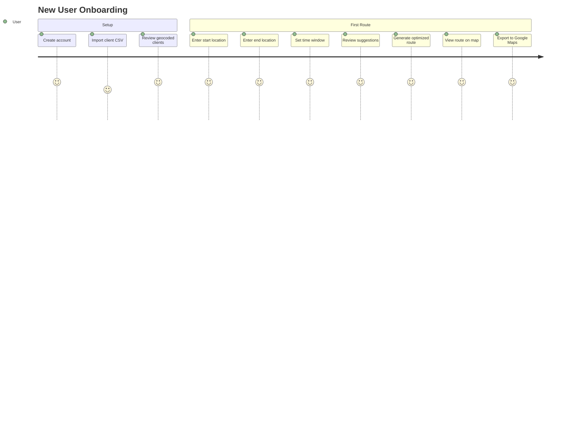
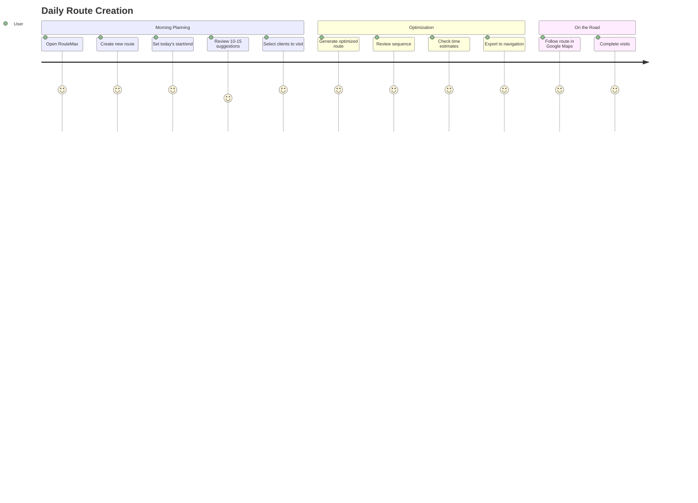
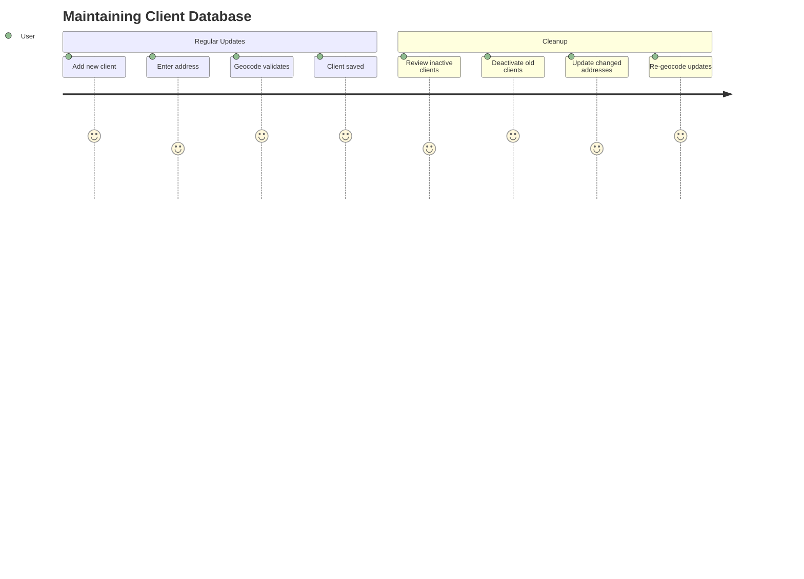

# PROJECT_BRIEF.md

RouteMax is a route optimization tool designed specifically for traveling salespeople to eliminate manual planning and maximize their time in the field.

## Executive Summary

- **Project Name**: RouteMax
- **Vision**: Save traveling salespeople 2+ hours per week by automating client selection and route sequencing
- **Mission**: Build an intelligent route planner that automatically identifies and sequences the best clients to visit along a salesperson's daily route

### Full Description

RouteMax addresses the daily challenge faced by traveling salespeople who waste hours manually planning their routes. The application combines client database management with intelligent spatial analysis to automatically suggest which clients to visit based on route proximity, then optimizes the visit sequence using Google's routing algorithms. By eliminating spreadsheet juggling and guesswork, RouteMax lets salespeople focus on what matters: visiting more clients and closing more deals.

## Context

### Core Domain

RouteMax operates in the field sales optimization domain, specifically addressing the route planning challenge for individual traveling salespeople. The application bridges three key areas:

- **Client Management**: Maintaining an accurate, geocoded database of potential visit locations
- **Spatial Intelligence**: Using PostGIS geospatial queries to identify clients near a planned route
- **Route Optimization**: Leveraging Google Routes API to sequence visits efficiently while respecting time constraints

The system assumes users have an existing client base, plan single-day routes in advance, and prioritize time efficiency over other factors like client priority or visit frequency.

### Ubiquitous Language

| Term | Definition | Synonymes |
| ---- | ---------- | --------- |
| `Client` | A potential visit location with name and geocoded address | Customer, Stop Candidate |
| `Route` | A planned journey with start point, end point, and time window | Journey, Trip, Tournée |
| `Stop` | An individual visit location within a route sequence | Visit, Waypoint |
| `Geocoding` | Converting street addresses to latitude/longitude coordinates | Address Resolution |
| `Route Line` | The direct path between route start and end points | Route Corridor, Route Path |
| `Spatial Query` | Database search based on geographic distance/proximity | Geospatial Search |
| `Optimization` | Algorithmic reordering of stops to minimize travel time | Sequencing, Route Solving |
| `Suggested Client` | A client identified as being near the planned route | Route Candidate |
| `Visit Duration` | Expected time spent at a client location | Stop Time, Dwell Time |
| `Opening Hours` | Time window when a client is available for visits (default 9h-17h) | Business Hours, Availability Window |

## Features & Use-cases

- Import client database from CSV with automatic address geocoding
- Manage client list with add/edit/delete capabilities
- Configure route parameters with start/end locations and time windows
- **Auto-optimize routes** with automatic client discovery along path
- **Opening hours validation** - exclude clients visited outside business hours (9h-17h)
- Get intelligent client suggestions based on spatial proximity to route
- Generate optimized visit sequence minimizing total travel time
- **Lunch break scheduling** with configurable time and duration
- **Vehicle type selection** (driving, bicycling, walking)
- View route on interactive map with markers and polylines
- **Route timeline display** with client names, addresses, and estimated arrival times
- Export route to Google Maps for navigation
- Access route history and saved routes

## User Journey maps

### Traveling Salesperson

- Role: Field sales representative managing 50-200 clients across a territory
- Goals: Visit maximum clients per day, minimize driving time, maintain consistent territory coverage
- Pain Points: Hours wasted on manual planning, suboptimal route sequences, difficulty identifying nearby opportunities

#### First-Time Setup Journey

#### Daily Route Planning Journey

#### Client Database Management Journey

<!--
IMPORTANT: THOSE ARE RULES FOR AI, DO NOT USE THOSE INTO FILLED TEMPLATE.

- THIS FILE ANSWERS: WHAT problem does it solve?
- INCLUDE ONLY: Business purpose, user goals, features, requirements
- DO NOT INCLUDE: Technical details, how it's built, visual design
-->
