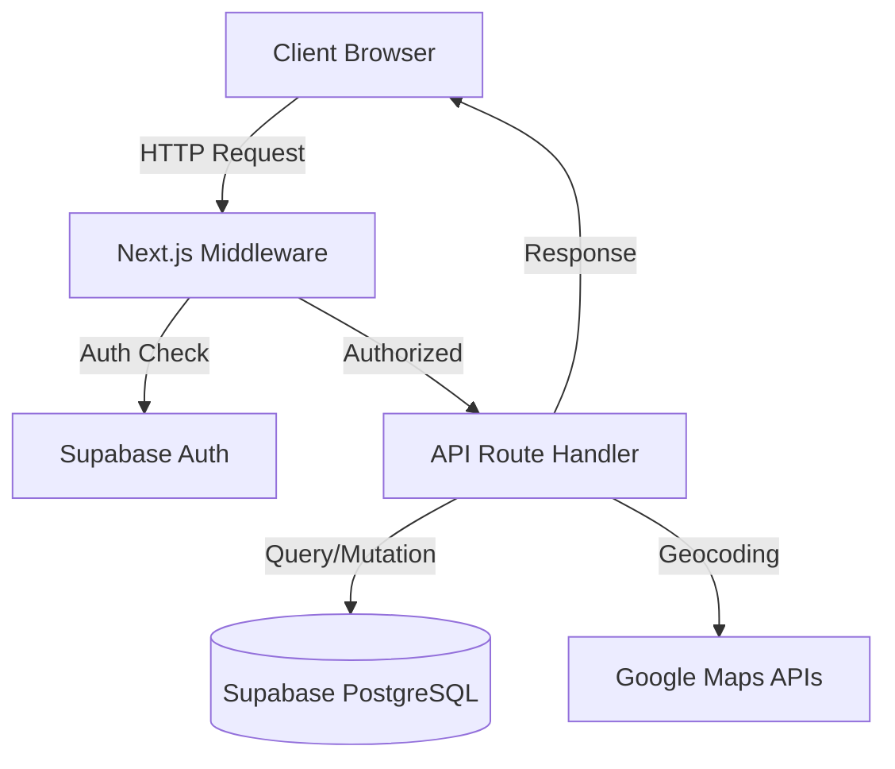
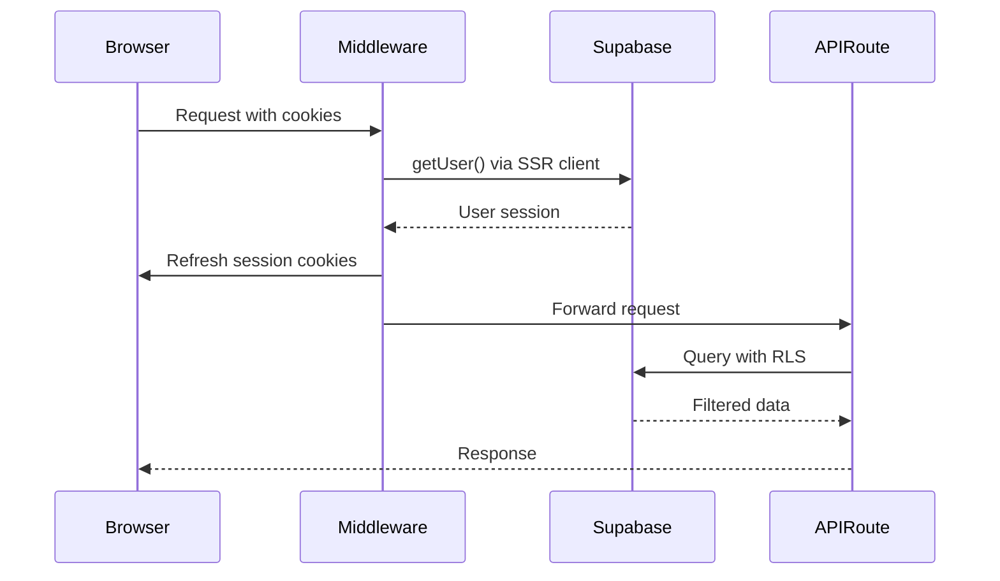
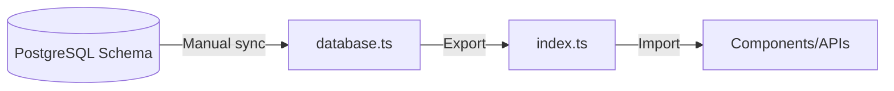

# Backend Architecture

## Stack

- Next.js 15 App Router (API Routes)
- Supabase (PostgreSQL + PostGIS + Auth)
- Google Maps APIs (Geocoding, Routes, Places)
- TypeScript 5
- Zod 4 (validation)

## Architecture Pattern

**Serverless API Routes** - Next.js App Router handles all backend operations through API routes at `@app/api/*`



## API Routes Structure

**8 fully implemented endpoints**:

- `@app/api/auth/logout/` - POST user logout
- `@app/api/clients/route.ts` - GET list clients, POST create client
- `@app/api/clients/[id]/route.ts` - GET/PUT/DELETE specific client
- `@app/api/clients/import/route.ts` - POST CSV import with geocoding
- `@app/api/routes/user/route.ts` - GET user's routes list
- `@app/api/routes/suggest/route.ts` - POST spatial client suggestions
- `@app/api/routes/optimize/route.ts` - POST create optimized route
- `@app/api/routes/[id]/route.ts` - GET/DELETE specific route

**WHY**: Next.js App Router convention - each directory represents a route segment

## Authentication Flow



**WHY**: Supabase SSR handles session management across server/client boundary

### Key Files

- `@middleware.ts` - Entry point, delegates to Supabase middleware
- `@lib/supabase/middleware.ts` - Session refresh logic using `@supabase/ssr`
- `@lib/supabase/server.ts` - Server-side Supabase client factory
- `@lib/supabase/client.ts` - Browser-side Supabase client factory

**WHY**: Separate clients prevent cookie access errors in different contexts

## Database Layer

### Tables

1. `clients` - User's client database
   - Geocoded addresses (lat/lng)
   - PostGIS geometry column for spatial queries
   - RLS enabled per user

2. `routes` - Saved route configurations
   - Start/end points with timestamps
   - Optimization metadata (JSONB)
   - RLS enabled per user

3. `route_stops` - Ordered stops per route
   - Links to clients or standalone addresses
   - Travel metrics (distance/duration)
   - RLS via route.user_id

**WHY**: Normalized schema separates concerns while maintaining referential integrity

### PostGIS Integration

```sql
-- Geometry column auto-updated via trigger
ALTER TABLE clients ADD COLUMN geom GEOMETRY(Point, 4326);

-- Spatial index for fast proximity queries
CREATE INDEX idx_clients_geom ON clients USING GIST(geom);
```

**WHY**: PostGIS enables efficient corridor search for client suggestions along routes

## Type Safety



- `@lib/types/database.ts` - Supabase table types (Row/Insert/Update)
- `@lib/types/index.ts` - Application domain types

**WHY**: TypeScript strict mode requires explicit types; manual sync needed (no auto-gen configured)

## External API Integration

### Google Maps Services

**Implemented integrations**:

- **Geocoding API** - Address to coordinates conversion (via `@lib/utils/geocode.ts`)
- **Routes Optimization API** - Multi-stop route optimization (via `/api/routes/optimize`)
- **Places API** - Address autocomplete (client-side)

Package: `@googlemaps/google-maps-services-js` v3

**WHY**: Server-side API key separation prevents client exposure

## Request/Response Flow

### Typical API Route Pattern

```typescript
// 1. Auth check (automatic via middleware)
// 2. Get Supabase client with user context
const supabase = await createClient()

// 3. Parse/validate request
const body = await request.json()
// Zod validation here

// 4. Database operation (RLS auto-filters by user_id)
const { data, error } = await supabase
  .from('clients')
  .select('*')

// 5. Error handling
if (error) throw error

// 6. Return JSON response
return Response.json(data)
```

**WHY**: Middleware handles auth, RLS handles authorization - no manual user_id checks needed

## Security Architecture

### Row Level Security (RLS)

All tables have policies enforcing `auth.uid() = user_id`:

```sql
CREATE POLICY "Users can view their own clients"
  ON clients FOR SELECT
  USING (auth.uid() = user_id);
```

**WHY**: Database-level security prevents privilege escalation bugs

### API Keys

- `NEXT_PUBLIC_GOOGLE_MAPS_API_KEY` - Browser (domain-restricted)
- `GOOGLE_MAPS_API_KEY_SERVER` - Server (IP-restricted)
- `NEXT_PUBLIC_SUPABASE_ANON_KEY` - Public (RLS protected)

**WHY**: Separate keys limit blast radius if exposed

## Data Validation

Zod 4 schemas for:
- Request body validation
- Response type safety
- CSV import parsing

**WHY**: Runtime validation catches malformed data before database operations

## Performance Considerations

### Indexes

- `idx_clients_user_id` - Filter by user
- `idx_clients_active` - Active clients only
- `idx_clients_geom` - Spatial queries (GIST)
- `idx_routes_created_at` - Recent routes first

**WHY**: Optimize common query patterns (user filtering, spatial search, sorting)

### Triggers

- `update_clients_updated_at` - Auto-timestamp on update
- `trigger_update_client_geom` - Sync geometry with lat/lng changes

**WHY**: Maintain data consistency without application-level logic

## Error Handling

**Implemented pattern**:
- Try-catch all async operations
- Return structured error responses with HTTP status codes
- Retry logic for external APIs (`@lib/utils/retry.ts`)
- User-friendly messages via toast notifications (Sonner)

**WHY**: Prevent unhandled promise rejections and expose minimal error details

## Cost Management

### Google Routes Optimization API

- $10 per 1,000 optimizations
- Budget alerts: $50, $100, $200
- Projected: $20/month (100 users, 5 routes/week each)

**WHY**: Monitor usage to prevent surprise bills; optimize API calls

## Development Status

Current state: **Production Ready - Fully Implemented**

- ✅ 8 API endpoints fully implemented
- ✅ Database schema deployed (6 migrations)
- ✅ Auth middleware configured
- ✅ Type definitions complete
- ✅ Google Maps integration (Geocoding, Routes API)
- ✅ CSV import with geocoding
- ✅ Spatial queries for client suggestions
- ✅ Route optimization with advanced settings
- ✅ Error handling and retry logic

**Recent features** (latest commit):

- Lunch break scheduling
- Vehicle type selection
