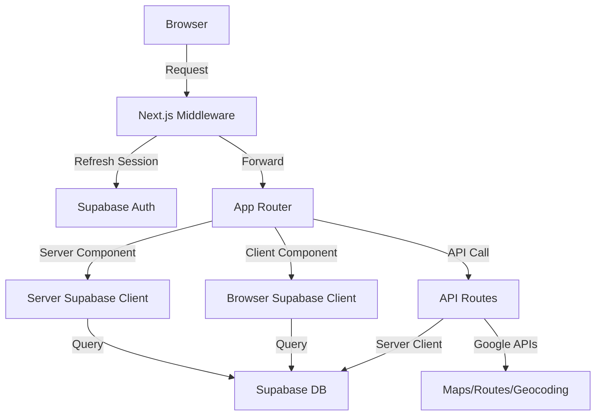
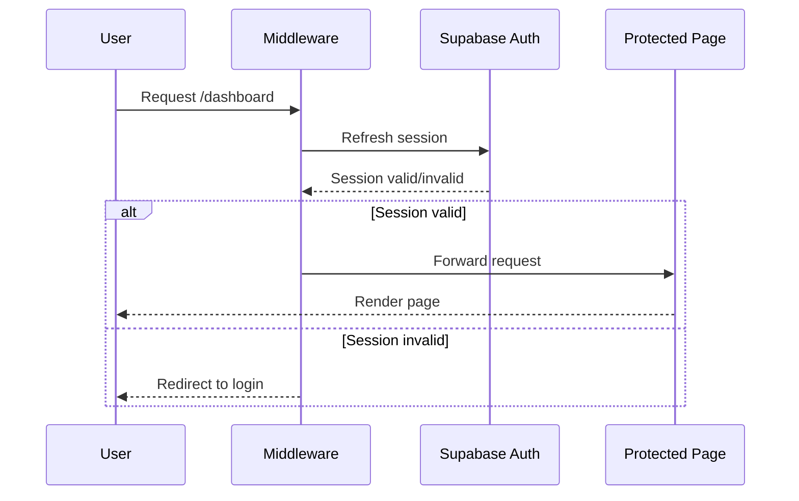

# Frontend Architecture

## Tech Stack

- Next.js 15 (App Router)
- React 19
- TypeScript 5 (strict mode)
- Tailwind CSS 4
- Supabase (auth + database)
- Google Maps APIs (@react-google-maps/api)

## Directory Structure

```
app/
├── api/                    # API Routes (Server-side)
│   ├── clients/           # Client management endpoints
│   ├── routes/            # Route optimization endpoints
│   └── geocode/           # Geocoding utility endpoint
├── dashboard/             # Protected app pages
│   ├── clients/           # Client management UI
│   └── routes/            # Route planning UI
├── layout.tsx             # Root layout (Server Component)
├── page.tsx               # Landing page (Server Component)
└── globals.css            # Global styles

components/                # React Components
├── clients/               # Client-related components
├── routes/                # Route-related components
└── ui/                    # Shared UI components

lib/
├── supabase/
│   ├── client.ts          # Browser client (Client Components)
│   ├── server.ts          # Server client (Server Components)
│   └── middleware.ts      # Auth session management
├── types/
│   ├── database.ts        # Supabase generated types
│   └── index.ts           # App domain types
└── utils/                 # Helper functions

middleware.ts              # Next.js middleware (auth)
```

## Architecture Patterns

### Next.js App Router

- Default to Server Components for data fetching
- Use Client Components only when needed (interactivity, hooks)
- API Routes for backend operations (auth-protected)
- Middleware for session refresh on every request

### Data Flow



### Component Architecture

- **Server Components** (default)
  - Data fetching from Supabase
  - No client-side JavaScript
  - Direct database access via @lib/supabase/server

- **Client Components** (`"use client"`)
  - User interactions
  - React hooks (useState, useEffect)
  - Browser APIs
  - Access database via @lib/supabase/client

### Supabase Integration

- **Three client types**
  - Browser client: @lib/supabase/client (Client Components)
  - Server client: @lib/supabase/server (Server Components, API Routes)
  - Middleware client: @lib/supabase/middleware (session refresh)

- **Authentication flow**
  - Middleware refreshes session on every request
  - Cookies managed via Next.js cookie API
  - RLS policies enforce data access

- **Type safety**
  - Database types in @lib/types/database
  - Generated from Supabase schema
  - Used for all client instances

## Key Design Decisions

### WHY App Router over Pages Router
- Server Components reduce client bundle size
- Built-in data fetching patterns
- Simplified routing with file-system
- Better SEO with default SSR

### WHY Supabase SSR Package
- Cookie-based session management
- Compatible with Next.js middleware
- Automatic session refresh
- Secure auth state across server/client

### WHY Separate API Routes
- Centralize business logic
- Protect API keys (Google Maps server key)
- Enable server-side validation with Zod
- Reusable across different UI components

### WHY TypeScript Strict Mode
- Catch errors at compile time
- Type-safe database queries
- Better IDE autocomplete
- Enforces null checks

### WHY Minimal Client Components
- Faster initial page load
- Better SEO
- Reduced JavaScript bundle
- Use only when needed (forms, maps, interactions)

## State Management

- **No global state library** (Redux, Zustand)
- Server Components fetch fresh data
- Client Components use React state (useState)
- URL state for pagination/filters
- Supabase real-time for live updates (future)

## Routing Strategy

```
/                          # Landing page (public)
/dashboard/clients         # Client list (protected)
/dashboard/routes          # Route planning (protected)
/api/clients/import        # CSV import endpoint
/api/routes/suggest        # Client suggestions
/api/routes/optimize       # Route optimization
```

## Authentication Flow



## API Route Pattern

All API routes follow this structure:

```typescript
// app/api/[resource]/route.ts
import { createClient } from '@/lib/supabase/server';

export async function POST(request: Request) {
  // 1. Auth check
  const supabase = await createClient();
  const { data: { user } } = await supabase.auth.getUser();
  if (!user) return Response.json({ error: 'Unauthorized' }, { status: 401 });

  // 2. Parse and validate input
  const body = await request.json();
  const validated = schema.parse(body); // Zod

  // 3. Business logic
  const result = await doSomething(validated);

  // 4. Return response
  return Response.json(result);
}
```

## Data Access Patterns

### Server Component
```typescript
import { createClient } from '@/lib/supabase/server';

export default async function Page() {
  const supabase = await createClient();
  const { data } = await supabase.from('clients').select();
  return <List clients={data} />;
}
```

### Client Component
```typescript
'use client';
import { createClient } from '@/lib/supabase/client';

export function ClientList() {
  const [clients, setClients] = useState([]);
  const supabase = createClient();

  useEffect(() => {
    supabase.from('clients').select()
      .then(({ data }) => setClients(data));
  }, []);

  return <ul>{clients.map(...)}</ul>;
}
```

### API Route Call
```typescript
'use client';

async function importClients(file: File) {
  const formData = new FormData();
  formData.append('file', file);

  const response = await fetch('/api/clients/import', {
    method: 'POST',
    body: formData,
  });

  return response.json();
}
```

## Error Handling

- All async operations wrapped in try-catch
- API routes return proper HTTP status codes
- Client-side errors shown via `sonner` toast
- Server errors logged to console (Vercel logs)

## Performance Strategies

- Server Components for static content
- Dynamic imports for large client components
- Google Maps lazy loading
- Database queries use indexes
- Pagination for large lists

## Security Measures

- RLS policies on all tables
- API keys in environment variables
- Server-only API key (Google Maps)
- CSRF protection via Supabase
- Input validation with Zod

## Environment Configuration

```env
# Public (exposed to browser)
NEXT_PUBLIC_SUPABASE_URL
NEXT_PUBLIC_SUPABASE_ANON_KEY
NEXT_PUBLIC_GOOGLE_MAPS_API_KEY
NEXT_PUBLIC_APP_URL

# Private (server-only)
GOOGLE_MAPS_API_KEY_SERVER
GOOGLE_CLOUD_PROJECT_ID
```

## Future Considerations

- Real-time updates with Supabase subscriptions
- Optimistic UI updates
- Client-side caching (React Query)
- Progressive Web App (PWA)
- Offline support
